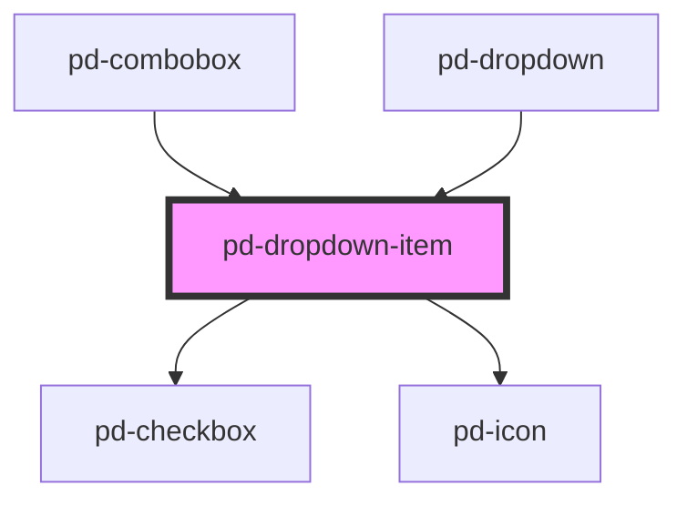

# pd-dropdown-item

<!-- Auto Generated Below -->

## Properties

| Property      | Attribute     | Description                                                           | Type               | Default     |
| ------------- | ------------- | --------------------------------------------------------------------- | ------------------ | ----------- |
| `highlight`   | `highlight`   | Find an highlight this text in value                                  | `number \| string` | `undefined` |
| `iconName`    | `icon-name`   | Displays an item from the provided gallery                            | `string`           | `undefined` |
| `iconSrc`     | `icon-src`    | Specifies the `src` url of an SVG file to use as icon.                | `string`           | `undefined` |
| `multiselect` | `multiselect` | If `true`, the item displays a checkbox (for multiselect comboboxes). | `boolean`          | `false`     |
| `selected`    | `selected`    | Sets this item to selected                                            | `boolean`          | `false`     |
| `value`       | `value`       | Value for this item                                                   | `string`           | `''`        |

## Dependencies

### Used by

 - [pd-combobox](../pd-combobox)
 - [pd-dropdown](../pd-dropdown)

### Depends on

- [pd-checkbox](../pd-checkbox)
- [pd-icon](../pd-icon)

### Graph

----------------------------------------------

*Built with [StencilJS](https://stenciljs.com/)*
