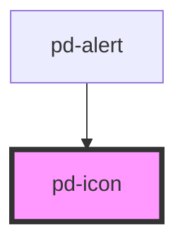

# pd-icon

## Custom assets base path

If you want to host assets sepearate to the library, a custom base path can be set using a meta tag

```html
<meta name="parlamentsdienste-base-path" content="https://somedomain.com/somepath/somefolder/" />
```

## Usage

#### With Source File

```html
<pd-icon src="/assets/icons/cancel.svg"></pd-icon>
```

#### With Name

```html
<pd-icon name="cancel"></pd-icon>
```

## Available Icon Names

| []()                    |                         |                    |                   |
| ----------------------- | ----------------------- | ------------------ | ----------------- |
| `add`                   | `alert_danger`          | `alert_info`       | `alert_success`   |
| `alert_warning`         | `appview`               | `audio`            | `bill`            |
| `breadcrumb`            | `calendar`              | `cancel`           | `caret`           |
| `checkbox_checked`      | `checkbox_default`      | `clipboard`        | `close`           |
| `close_bold`            | `close_small`           | `comment`          | `compensation`    |
| `configuration`         | `confirm`               | `confirm_bold`     | `contact`         |
| `copy`                  | `delete`                | `detail`           | `dictionary`      |
| `documents`             | `download`              | `drag_drop`        | `dropdown`        |
| `edit`                  | `excel_export`          | `expand`           | `export`          |
| `file`                  | `file_excel`            | `file_image`       | `file_powerpoint` |
| `file_word`             | `filter`                | `folder_closed`    | `folder_open`     |
| `gallery`               | `geschaeftsverwaltung`  | `group`            | `history`         |
| `link`                  | `link_connection`       | `list`             | `lock`            |
| `menu`                  | `menu_actions`          | `message`          | `microphone`      |
| `mehrjahresplanung`     | `multiple_files`        | `my_calendar`      | `my_clipboard`    |
| `notification`          | `parlament`             | `pdf_file`         | `planung_organe`  |
| `planung_session`       | `play`                  | `press`            | `print`           |
| `profile`               | `proposal`              | `radio_checked`    | `radio_default`   |
| `ratsmitglied_gruppen`  | `research`              | `reservation`      | `response`        |
| `search`                | `sessionsdurchfuehrung` | `shrink`           | `sign`            |
| `sitzungsdurchfuehrung` | `sort`                  | `status_blue`      | `status_green`    |
| `status_orange`         | `status_red`            | `status_undefined` | `support`         |
| `upload`                |                         |                    |                   |

<!-- Auto Generated Below -->


## Properties

| Property          | Attribute          | Description                                    | Type                 | Default     |
| ----------------- | ------------------ | ---------------------------------------------- | -------------------- | ----------- |
| `flip`            | `flip`             | Flip in X/Y direction                          | `"x" \| "xy" \| "y"` | `undefined` |
| `iconDescription` | `icon-description` | description tag in svg for accessability       | `string`             | `undefined` |
| `iconTitle`       | `icon-title`       | title tag in svg for accessability             | `string`             | `undefined` |
| `lazy`            | `lazy`             | Icon will be loaded lazily when it is visible  | `boolean`            | `true`      |
| `name`            | `name`             | Name of an icon from the provided gallery      | `string`             | `undefined` |
| `rotate`          | `rotate`           | Rotation in 'deg'                              | `number`             | `0`         |
| `size`            | `size`             | Size of the icon in 'rem'                      | `number`             | `undefined` |
| `spin`            | `spin`             | Spin animation in ms per rotation              | `number`             | `undefined` |
| `spinReverse`     | `spin-reverse`     | change animation direction                     | `boolean`            | `false`     |
| `src`             | `src`              | Specifies the `src` url of an SVG file to use. | `string`             | `undefined` |


## Dependencies

### Used by

 - [pd-alert](../pd-alert)

### Graph


----------------------------------------------

*Built with [StencilJS](https://stenciljs.com/)*
