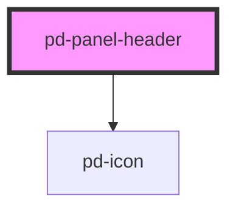

# pd-panel-header

<!-- Auto Generated Below -->

## Events

| Event      | Description                   | Type                   |
| ---------- | ----------------------------- | ---------------------- |
| `pd-hover` | Used for panel hover stylings | `CustomEvent<boolean>` |

## Methods

### `setCollapsed(collapsed: boolean) => Promise<void>`

#### Parameters

| Name        | Type      | Description |
| ----------- | --------- | ----------- |
| `collapsed` | `boolean` |             |

#### Returns

Type: `Promise<void>`

## Slots

| Slot         | Description                     |
| ------------ | ------------------------------- |
|              | Header content                  |
| `"icons"`    | Additional icons left of carret |
| `"subtitle"` | panel header subtitle content   |

## Dependencies

### Depends on

- [pd-icon](../pd-icon)

### Graph

----------------------------------------------

*Built with [StencilJS](https://stenciljs.com/)*
