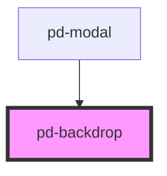

# pd-backdrop

<!-- Auto Generated Below -->

## Properties

| Property  | Attribute | Description                          | Type      | Default |
| --------- | --------- | ------------------------------------ | --------- | ------- |
| `visible` | `visible` | Invisible backdrop when set to false | `boolean` | `true`  |

## Events

| Event     | Description | Type                |
| --------- | ----------- | ------------------- |
| `pdOnTap` |             | `CustomEvent<void>` |

## Dependencies

### Used by

 - [pd-modal](../modal)

### Graph

----------------------------------------------

*Built with [StencilJS](https://stenciljs.com/)*
