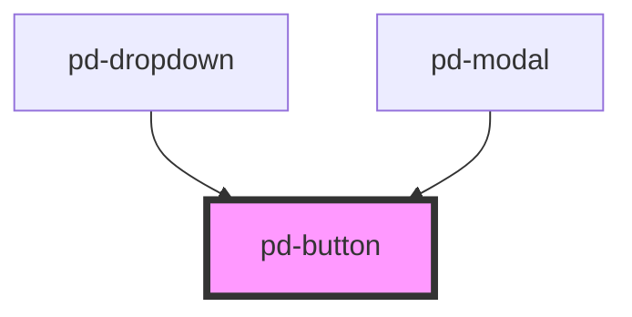

# pd-button

<!-- Auto Generated Below -->

## Properties

| Property   | Attribute  | Description                               | Type                                                                             | Default     |
| ---------- | ---------- | ----------------------------------------- | -------------------------------------------------------------------------------- | ----------- |
| `color`    | `color`    | Color schema used for the button          | `"danger" \| "dark" \| "info" \| "light" \| "primary" \| "success" \| "warning"` | `'primary'` |
| `disabled` | `disabled` | Sets button to disbaled state             | `boolean`                                                                        | `false`     |
| `href`     | `href`     | Set href to create a link button          | `string`                                                                         | `undefined` |
| `outline`  | `outline`  | Use outline schema                        | `boolean`                                                                        | `false`     |
| `size`     | `size`     | Button size                               | `"large" \| "normal" \| "small"`                                                 | `'normal'`  |
| `target`   | `target`   | Sets target for link button e.g. '_blank' | `string`                                                                         | `undefined` |
| `type`     | `type`     | Sets button type \|text\|submit\|reset\|  | `"button" \| "submit" \| "text"`                                                 | `'button'`  |

## Dependencies

### Used by

 - [pd-dropdown](../dropdown)
 - [pd-modal](../modal)

### Graph

----------------------------------------------

*Built with [StencilJS](https://stenciljs.com/)*
