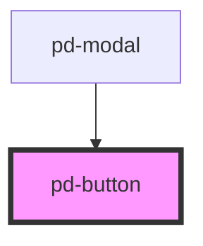

# pd-button

<!-- Auto Generated Below -->

## Properties

| Property   | Attribute  | Description                               | Type                             | Default     |
| ---------- | ---------- | ----------------------------------------- | -------------------------------- | ----------- |
| `disabled` | `disabled` | Sets button to disbaled state             | `boolean`                        | `false`     |
| `href`     | `href`     | Set href to create a link button          | `string`                         | `undefined` |
| `target`   | `target`   | Sets target for link button e.g. '_blank' | `string`                         | `undefined` |
| `type`     | `type`     | Sets button type \|text\|submit\|reset\|  | `"button" \| "submit" \| "text"` | `'button'`  |

## Dependencies

### Used by

 - [pd-modal](../modal)

### Graph

----------------------------------------------

*Built with [StencilJS](https://stenciljs.com/)*
