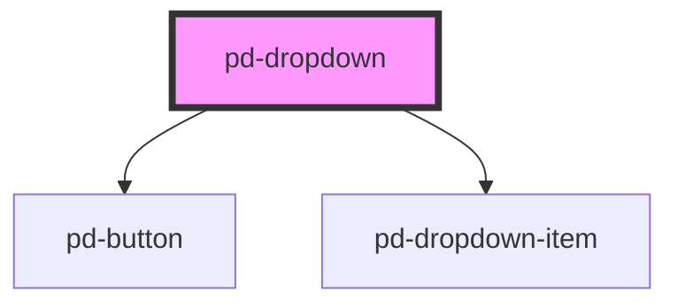

# pd-dropdown

## Usage

```html
<pd-dropdown>
    <pd-dropdown-item>item 1</pd-dropdown-item>
    <pd-dropdown-item>item 1</pd-dropdown-item>
    <pd-dropdown-item>item 1</pd-dropdown-item>
</pd-dropdown>
```

<!-- Auto Generated Below -->

## Properties

| Property     | Attribute     | Description | Type     | Default |
| ------------ | ------------- | ----------- | -------- | ------- |
| `helperText` | `helper-text` |             | `string` | `''`    |
| `label`      | `label`       |             | `string` | `''`    |

## Dependencies

### Depends on

-   [pd-button](../button)
-   [pd-dropdown-item](../dropdown-item)

### Graph



---

_Built with [StencilJS](https://stenciljs.com/)_
