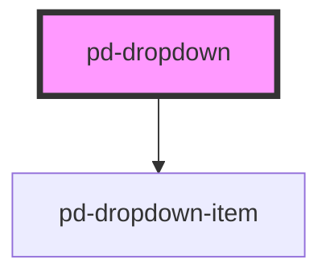

# pd-dropdown

## Usage

```html
<pd-dropdown items="..."></pd-dropdown>
```

<!-- Auto Generated Below -->


## Properties

| Property      | Attribute     | Description | Type             | Default         |
| ------------- | ------------- | ----------- | ---------------- | --------------- |
| `items`       | --            |             | `DropdownItem[]` | `[]`            |
| `placeholder` | `placeholder` |             | `string`         | `'Placeholder'` |


## Dependencies

### Depends on

- [pd-dropdown-item](../dropdown-item)

### Graph


----------------------------------------------

*Built with [StencilJS](https://stenciljs.com/)*
