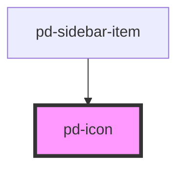

# pd-icon

<!-- Auto Generated Below -->

## Properties

| Property | Attribute | Description                                      | Type     | Default     |
| -------- | --------- | ------------------------------------------------ | -------- | ----------- |
| `src`    | `src`     | Specifies the exact `src` of an SVG file to use. | `string` | `undefined` |

## Dependencies

### Used by

 - [pd-sidebar-item](../sidebar-item)

### Graph

----------------------------------------------

*Built with [StencilJS](https://stenciljs.com/)*
