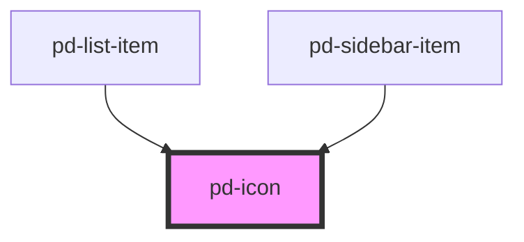

# pd-icon

## Usage

#### With Source File

```html
<pd-icon src="/assets/icons/mail.svg"></pd-icon>
```

#### With Name

```html
<pd-icon name="mail"></pd-icon>
```

## Available Icon Names

| []()        |           |           |            |                  |                  |               |               |
| ----------- | --------- | --------- | ---------- | ---------------- | ---------------- | ------------- | ------------- |
| parlament   | checkmark | cancel    | minus      | checkbox-default | checkbox-checked | radio-default | radio-checked |
| cancel-ring | calendar  | profile   | dictionary | contacts         | search           | caret         | expand        |
| explorer    | folder    | folder-in | link       | grid             | configuration    | list          | menu          |
| mail        | money     | press     | print      | support          |

<!-- Auto Generated Below -->


## Properties

| Property      | Attribute      | Description                                    | Type                               | Default     |
| ------------- | -------------- | ---------------------------------------------- | ---------------------------------- | ----------- |
| `flip`        | `flip`         | Flip in X/Y direction                          | `"x" \| "xy" \| "y"`               | `undefined` |
| `name`        | `name`         | Name of an icon from the provided gallery      | `string`                           | `undefined` |
| `rotate`      | `rotate`       | Rotation in 'deg'                              | `number`                           | `0`         |
| `size`        | `size`         | Size of the icon                               | `"default" \| "large" \| "normal"` | `'default'` |
| `spin`        | `spin`         | Spin animation in ms per rotation              | `number`                           | `undefined` |
| `spinReverse` | `spin-reverse` | change animation direction                     | `boolean`                          | `false`     |
| `src`         | `src`          | Specifies the `src` url of an SVG file to use. | `string`                           | `undefined` |


## Dependencies

### Used by

 - [pd-list-item](../list-item)
 - [pd-sidebar-item](../sidebar-item)

### Graph


----------------------------------------------

*Built with [StencilJS](https://stenciljs.com/)*
