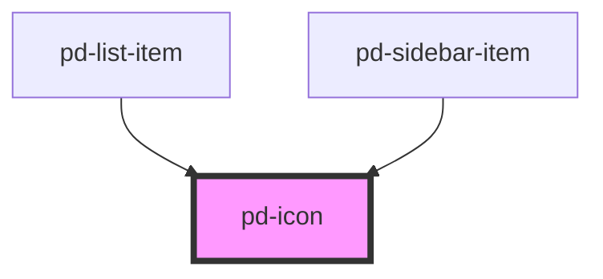

# pd-icon

<!-- Auto Generated Below -->

## Properties

| Property | Attribute | Description                                      | Type                               | Default     |
| -------- | --------- | ------------------------------------------------ | ---------------------------------- | ----------- |
| `flip`   | `flip`    | Flip in X/Y direction                            | `"x" \| "xy" \| "y"`               | `undefined` |
| `name`   | `name`    | Name of an icon from the provided gallery        | `string`                           | `undefined` |
| `rotate` | `rotate`  | Rotation in degrees                              | `number`                           | `0`         |
| `size`   | `size`    | Size of the icon                                 | `"default" \| "large" \| "normal"` | `'default'` |
| `spin`   | `spin`    | Spin animation in ms per rotation                | `number`                           | `undefined` |
| `src`    | `src`     | Specifies the exact `src` of an SVG file to use. | `string`                           | `undefined` |

## Dependencies

### Used by

 - [pd-list-item](../list-item)
 - [pd-sidebar-item](../sidebar-item)

### Graph

----------------------------------------------

*Built with [StencilJS](https://stenciljs.com/)*
