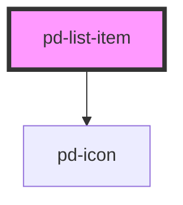

# pd-list-item

<!-- Auto Generated Below -->

## Properties

| Property | Attribute | Description | Type                               | Default     |
| -------- | --------- | ----------- | ---------------------------------- | ----------- |
| `status` | `status`  |             | `"danger" \| "success" \| "unset"` | `undefined` |

## Dependencies

### Depends on

- [pd-icon](../icon)

### Graph

----------------------------------------------

*Built with [StencilJS](https://stenciljs.com/)*
