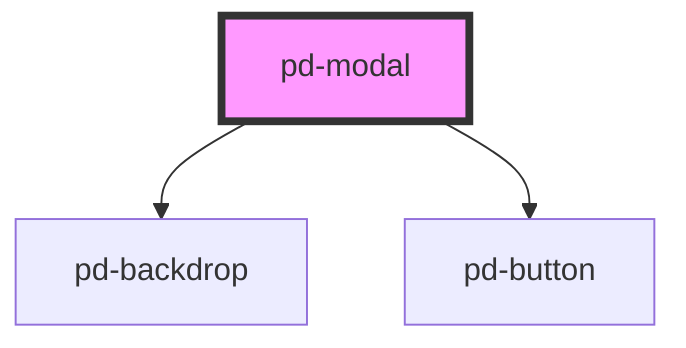

# pd-modal

<!-- Auto Generated Below -->

## Methods

### `closeModal() => Promise<boolean>`

#### Returns

Type: `Promise<boolean>`

### `openModal() => Promise<void>`

#### Returns

Type: `Promise<void>`

## Dependencies

### Depends on

- [pd-backdrop](../backdrop)
- [pd-button](../button)

### Graph

----------------------------------------------

*Built with [StencilJS](https://stenciljs.com/)*
