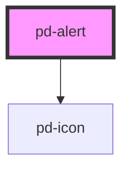

# pd-alert

<!-- Auto Generated Below -->

## Properties

| Property       | Attribute       | Description                                     | Type                                                                             | Default     |
| -------------- | --------------- | ----------------------------------------------- | -------------------------------------------------------------------------------- | ----------- |
| `action`       | `action`        | Show action                                     | `boolean`                                                                        | `false`     |
| `actionHref`   | `action-href`   | A link displayed to the right side of the alert | `string`                                                                         | `undefined` |
| `actionTarget` | `action-target` | Target for action href (eg. _blank)             | `string`                                                                         | `'_blank'`  |
| `actionText`   | `action-text`   | Text to show on action                          | `string`                                                                         | `undefined` |
| `closable`     | `closable`      | Display an option to close the alert            | `boolean`                                                                        | `false`     |
| `color`        | `color`         | Color schema used for the alert                 | `"danger" \| "dark" \| "info" \| "light" \| "primary" \| "success" \| "warning"` | `'primary'` |

## Events

| Event          | Description                                    | Type                      |
| -------------- | ---------------------------------------------- | ------------------------- |
| `pd-on-closed` | Emitted when action closed button was pressed. | `CustomEvent<MouseEvent>` |

## Dependencies

### Depends on

- [pd-icon](../pd-icon)

### Graph

----------------------------------------------

*Built with [StencilJS](https://stenciljs.com/)*
