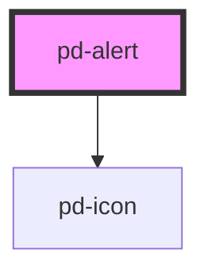

# pd-alert

## Usage

#### Alert

```html
<pd-alert color="primary">A simple primary alert</pd-alert>
```

#### Alert with action

```html
<pd-alert action-text="a button action">
    A simple alert with a button action
</pd-alert>
<pd-alert action-text="a link action" action-href="...">
    A simple alert with a link action
</pd-alert>
```

#### Expandable alert

```html
<pd-alert color="warning" action-text="Mehr anzeigen" expandable closable>
    <div>Infobox Heading</div>
    <div slot="expandable">
        Expandable content
    </div>
</pd-alert>

> The alert button
```

### vuejs Sample

```html
<pd-alert :color="alert.status" closable="true" @pd-closed="removeAlert">{{alert.message}}</pd-alert>
```

<!-- Auto Generated Below -->


## Properties

| Property       | Attribute       | Description                                     | Type                                                                             | Default     |
| -------------- | --------------- | ----------------------------------------------- | -------------------------------------------------------------------------------- | ----------- |
| `actionHref`   | `action-href`   | A link displayed to the right side of the alert | `string`                                                                         | `undefined` |
| `actionTarget` | `action-target` | Target for action href (eg. _blank)             | `string`                                                                         | `'_blank'`  |
| `actionText`   | `action-text`   | Text to show on action                          | `string`                                                                         | `undefined` |
| `closable`     | `closable`      | Display an option to close the alert            | `boolean`                                                                        | `false`     |
| `color`        | `color`         | Color schema used for the alert                 | `"danger" \| "dark" \| "info" \| "light" \| "primary" \| "success" \| "warning"` | `'primary'` |
| `expandable`   | `expandable`    | Enable expandable content                       | `boolean`                                                                        | `false`     |
| `expanded`     | `expanded`      | Expands / collapses the panel content           | `boolean`                                                                        | `false`     |
| `hideIcon`     | `hide-icon`     | Hide alert icon                                 | `boolean`                                                                        | `false`     |


## Events

| Event          | Description                                       | Type                      |
| -------------- | ------------------------------------------------- | ------------------------- |
| `pd-action`    | Emitted when action button was pressed.           | `CustomEvent<void>`       |
| `pd-closed`    | Emitted when close button was pressed.            | `CustomEvent<MouseEvent>` |
| `pd-collapsed` | Emitted when inner content is expanded/collapsed. | `CustomEvent<boolean>`    |


## Dependencies

### Depends on

- [pd-icon](../pd-icon)

### Graph


----------------------------------------------

*Built with [StencilJS](https://stenciljs.com/)*
