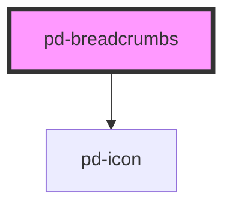

# pd-breadcrumbs

<!-- Auto Generated Below -->

## Properties

| Property | Attribute | Description | Type       | Default |
| -------- | --------- | ----------- | ---------- | ------- |
| `items`  | --        |             | `string[]` | `[]`    |

## Events

| Event             | Description | Type               |
| ----------------- | ----------- | ------------------ |
| `pd-on-navigated` |             | `CustomEvent<any>` |

## Dependencies

### Depends on

- [pd-icon](../pd-icon)

### Graph

----------------------------------------------

*Built with [StencilJS](https://stenciljs.com/)*
