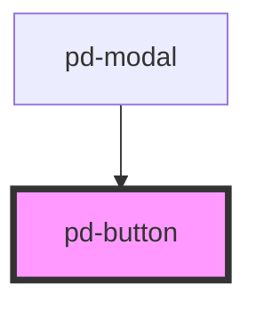

# pd-button

## Usage

#### Simple button

```html
<pd-button>Button</pd-button>
```

#### Button Group

```html
<pd-button-group>
    <pd-button>Button 1</pd-button>
    <pd-button>Button 2</pd-button>
    <pd-button>Button 3</pd-button>
</pd-button-group>
```

#### Link

```html
    <pd-button href="http://www.google.ch">Link</pd-button>
```

## Styles

| Style                      | Default | Description                                    |
| -------------------------- | ------- | ---------------------------------------------- |
| `--pd-button-left-radius`  | `4px`   | border radius for the left side of the button  |
| `--pd-button-right-radius` | `4px`   | border radius for the right side of the button |

<!-- Auto Generated Below -->


## Properties

| Property       | Attribute       | Description                               | Type                                                                             | Default     |
| -------------- | --------------- | ----------------------------------------- | -------------------------------------------------------------------------------- | ----------- |
| `color`        | `color`         | Color schema used for the button          | `"danger" \| "dark" \| "info" \| "light" \| "primary" \| "success" \| "warning"` | `'primary'` |
| `disabled`     | `disabled`      | Sets button to disbaled state             | `boolean`                                                                        | `false`     |
| `href`         | `href`          | Set href to create a link button          | `string`                                                                         | `undefined` |
| `iconLocation` | `icon-location` |                                           | `"left" \| "right"`                                                              | `'left'`    |
| `outline`      | `outline`       | Use outline schema                        | `boolean`                                                                        | `false`     |
| `size`         | `size`          | Button size                               | `"large" \| "normal" \| "small"`                                                 | `'normal'`  |
| `target`       | `target`        | Sets target for link button e.g. '_blank' | `string`                                                                         | `undefined` |
| `type`         | `type`          | Sets button type \|text\|submit\|reset\|  | `"button" \| "submit" \| "text"`                                                 | `'button'`  |


## Dependencies

### Used by

 - [pd-modal](../pd-modal)

### Graph


----------------------------------------------

*Built with [StencilJS](https://stenciljs.com/)*
