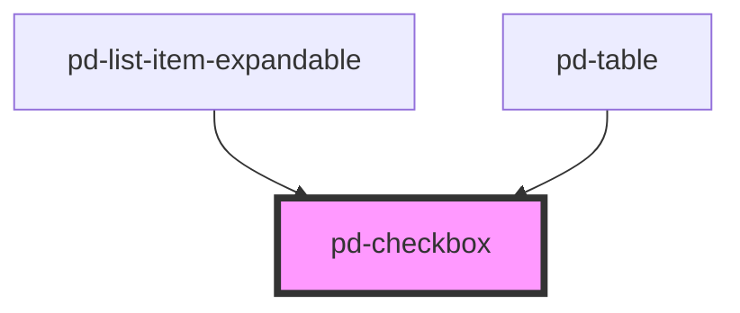

# pd-checkbox

## Usage

#### Checkbox

```html
<pd-checkbox checked text="checkbox"></pd-checkbox>
```

<br><br>

### vuejs Sample

```html
<pd-checkbox class="form-group" text="button disabled" v-model-pd="checked"></pd-checkbox>
```

Webcomponents don't work with v-model out of the box therefore we provide a custom directive which allows the same behaviour.
For more info on the v-model-pd directive check here [v-model-pd](/story/vuejs-directives--model-directive)

## Styles

| Style                             | Default       | Description                      |
| --------------------------------- | ------------- | -------------------------------- |
| `--pd-checkbox-text-padding-left` | `0.625rem`    | padding on the left side of text |
| `--pd-checkbox-background-color`  | `transparent` | background color                 |

<!-- Auto Generated Below -->


## Properties

| Property          | Attribute          | Description                                                        | Type      | Default     |
| ----------------- | ------------------ | ------------------------------------------------------------------ | --------- | ----------- |
| `checked`         | `checked`          | Sets check state of the checkbox true/false                        | `boolean` | `false`     |
| `disabled`        | `disabled`         | Sets checkbox to disabled state                                    | `boolean` | `false`     |
| `error`           | `error`            |                                                                    | `boolean` | `false`     |
| `isIndeterminate` | `is-indeterminate` | indeterminate state                                                | `boolean` | `false`     |
| `name`            | `name`             | checkbox name                                                      | `string`  | `undefined` |
| `readonly`        | `readonly`         | If `true`, the user cannot modify the value.                       | `boolean` | `false`     |
| `required`        | `required`         | If `true`, the user must fill in a value before submitting a form. | `boolean` | `false`     |
| `text`            | `text`             | Checkbox description text                                          | `string`  | `''`        |
| `value`           | `value`            | value of checkbox                                                  | `boolean` | `false`     |


## Events

| Event        | Description | Type                   |
| ------------ | ----------- | ---------------------- |
| `pd-checked` |             | `CustomEvent<boolean>` |


## Dependencies

### Used by

 - [pd-list-item-expandable](../pd-list-item-expandable)
 - [pd-table](../pd-table)

### Graph


----------------------------------------------

*Built with [StencilJS](https://stenciljs.com/)*
