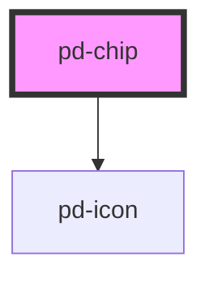

# pd-chip

## Usage

#### Text Chip

```html
<pd-chip>Chip Name</pd-chip>
```

#### Toggle Chip

```html
<pd-chip type="toggle">Toggle</pd-chip>
```

#### Filter Chip

```html
<pd-chip type="filter">Filter</pd-chip>
```

<!-- Auto Generated Below -->


## Properties

| Property   | Attribute  | Description                             | Type                             | Default  |
| ---------- | ---------- | --------------------------------------- | -------------------------------- | -------- |
| `checked`  | `checked`  | Sets chip to checked state              | `boolean`                        | `false`  |
| `disabled` | `disabled` | Sets chip to disabled state             | `boolean`                        | `false`  |
| `readonly` | `readonly` | Sets chip to readonly state             | `boolean`                        | `false`  |
| `type`     | `type`     | Sets chip type \|text\|toggle\|filter\| | `"filter" \| "text" \| "toggle"` | `'text'` |


## Events

| Event        | Description                                   | Type               |
| ------------ | --------------------------------------------- | ------------------ |
| `checkChip`  | Event for check chip                          | `CustomEvent<any>` |
| `removeChip` | Event for clicking the cross to remove a chip | `CustomEvent<any>` |


## Dependencies

### Depends on

- [pd-icon](../pd-icon)

### Graph


----------------------------------------------

*Built with [StencilJS](https://stenciljs.com/)*
