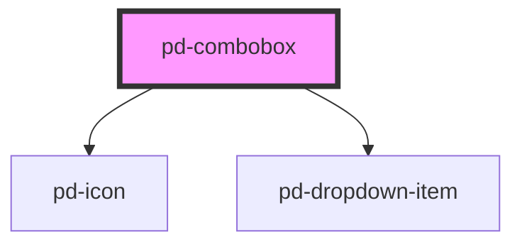

# pd-combobox

## Usage

```html
<pd-combobox label="label" results="..."></pd-combobox>
```

Combobox results must be provided dynamically depending on the current input. `pd-input` can be used to detect when a new combobox result should be provided.

```javascript
const results = [
    { id: '1', label: 'Dropdown Link 01', value: 'a1' },
    { id: '2', label: 'Dropdown Link 02', value: 'a2' },
    { id: '3', label: 'Dropdown Link 03', value: 'a3' },
    ...
];
```

<br><br>

### vuejs Sample

```html
<pd-combobox
    placeholder="Suche"
    :results.props="suggestions"
    @pd-input="suggest($event.detail.value)"
    :value="combobox"
    @pd-combobox="comboboxText($event.detail.value)"
></pd-combobox>
```

_To pass arrays or objects to webcomponents you need to append the attribute name with the `.props` modifier._
More info on [props modifier](https://vuejs.org/v2/api/#v-bind)

## Interfaces

```javascript
interface DropdownItem {
    id: string;
    label: string;
    value: string;
    selected?: boolean;
}
```

<!-- Auto Generated Below -->


## Properties

| Property         | Attribute         | Description                                                        | Type             | Default     |
| ---------------- | ----------------- | ------------------------------------------------------------------ | ---------------- | ----------- |
| `disabled`       | `disabled`        | If `true`, the user cannot interact with the input.                | `boolean`        | `false`     |
| `error`          | `error`           | Shows error state                                                  | `boolean`        | `false`     |
| `highlight`      | `highlight`       | Show matching parts in results as highlighted                      | `boolean`        | `true`      |
| `items`          | --                | Values shown as combobox items                                     | `ComboboxItem[]` | `[]`        |
| `label`          | `label`           | combobox box label                                                 | `string`         | `undefined` |
| `placeholder`    | `placeholder`     | Instructional text that shows before the input has a value.        | `string`         | `undefined` |
| `readonly`       | `readonly`        | If `true`, the user cannot modify the value.                       | `boolean`        | `false`     |
| `required`       | `required`        | If `true`, the user must fill in a value before submitting a form. | `boolean`        | `false`     |
| `selectable`     | `selectable`      | If `true`, the combobox get a selected state like a dropdown.      | `boolean`        | `false`     |
| `size`           | `size`            | Input tag size (check pd-input 'size' for more info)               | `number`         | `1`         |
| `value`          | `value`           | The value of the input.                                            | `string`         | `''`        |
| `verticalAdjust` | `vertical-adjust` | Default vertical adjustment for inline forms                       | `boolean`        | `false`     |


## Events

| Event         | Description                               | Type                                  |
| ------------- | ----------------------------------------- | ------------------------------------- |
| `pd-blur`     | Emitted when the input loses focus.       | `CustomEvent<void>`                   |
| `pd-change`   | Emitted when the value has changed.       | `CustomEvent<ComboboxItem>`           |
| `pd-combobox` | Emitted when a combobox request occurred. | `CustomEvent<ComboboxItem>`           |
| `pd-focus`    | Emitted when the input has focus.         | `CustomEvent<void>`                   |
| `pd-input`    | Emitted when a keyboard input occurred.   | `CustomEvent<InputChangeEventDetail>` |


## Methods

### `reset() => Promise<void>`

Reset the selection of the dropdown

#### Returns

Type: `Promise<void>`


### `setFocus() => Promise<void>`

Sets focus on the specified `pd-input`. Use this method instead of the global
`input.focus()`.

#### Returns

Type: `Promise<void>`


### `setSelectedIndex(index: number) => Promise<void>`

Set a preselected entry by index

#### Returns

Type: `Promise<void>`


## CSS Custom Properties

| Name                            | Description         |
| ------------------------------- | ------------------- |
| `--pd-checkbox-vertical-adjust` | top margin of label |


## Dependencies

### Depends on

- [pd-icon](../pd-icon)
- [pd-dropdown-item](../pd-dropdown-item)

### Graph


----------------------------------------------

*Built with [StencilJS](https://stenciljs.com/)*
