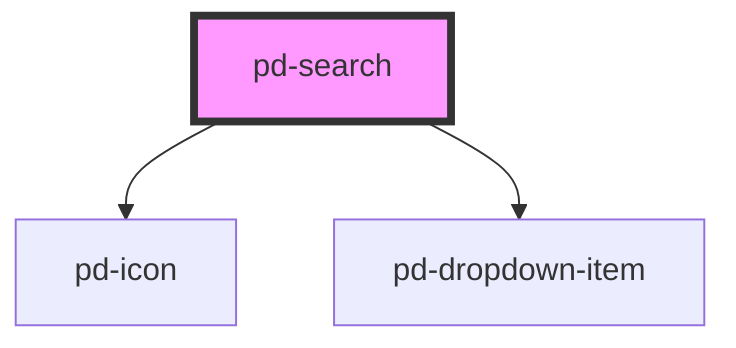

# pd-combobox

## Usage

```html
<pd-combobox label="label" results="..."></pd-combobox>
```

Combobox results must be provided dynamically depending on the current input. `pd-input` can be used to detect when a new combobox result should be provided.

```javascript
const results = [
    `Some random result 1`,
    `Some random result 2`,
    `Some random result 3`,
    ...
];
```

<br><br>

### vuejs Sample

```html
<pd-combobox
    placeholder="Suche"
    :results.prop="suggestions"
    @pd-input="suggest($event.detail.value)"
    :value="combobox"
    @pd-combobox="comboboxText($event.detail.value)"
></pd-combobox>
```

_To pass arrays or objects to webcomponents you need to append the attribute name with the `.prop` modifier._
More info on [prop modifier](https://vuejs.org/v2/api/#v-bind)

## Interfaces

```javascript
interface DropdownItem {
    id: string;
    label: string;
    value: string;
    selected?: boolean;
}
```

<!-- Auto Generated Below -->

## Properties

| Property      | Attribute     | Description                                                 | Type               | Default     |
| ------------- | ------------- | ----------------------------------------------------------- | ------------------ | ----------- |
| `disabled`    | `disabled`    | If `true`, the user cannot interact with the input.         | `boolean`          | `false`     |
| `highlight`   | `highlight`   | Show matching parts in results as highlighted               | `boolean`          | `true`      |
| `label`       | `label`       | Search box label                                            | `string`           | `undefined` |
| `placeholder` | `placeholder` | Instructional text that shows before the input has a value. | `string`           | `undefined` |
| `results`     | --            | Values shown as search results                              | `string[]`         | `[]`        |
| `value`       | `value`       | The value of the input.                                     | `number \| string` | `''`        |

## Events

| Event       | Description                             | Type                                  |
| ----------- | --------------------------------------- | ------------------------------------- |
| `pd-blur`   | Emitted when the input loses focus.     | `CustomEvent<void>`                   |
| `pd-change` | Emitted when the value has changed.     | `CustomEvent<InputChangeEventDetail>` |
| `pd-focus`  | Emitted when the input has focus.       | `CustomEvent<void>`                   |
| `pd-input`  | Emitted when a keyboard input occurred. | `CustomEvent<InputChangeEventDetail>` |
| `pd-search` | Emitted when a search request occurred. | `CustomEvent<InputChangeEventDetail>` |

## Methods

### `setFocus() => Promise<void>`

Sets focus on the specified `pd-input`. Use this method instead of the global
`input.focus()`.

#### Returns

Type: `Promise<void>`

## Dependencies

### Depends on

-   [pd-icon](../pd-icon)
-   [pd-dropdown-item](../pd-dropdown-item)

### Graph



---

_Built with [StencilJS](https://stenciljs.com/)_
