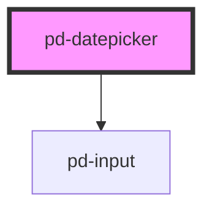

# pd-datepicker

<!-- Auto Generated Below -->

## Properties

| Property   | Attribute  | Description                                                                                                                                                     | Type                                                                                                                                                                                                                                                                                                                                                                                                                                                                                                                                                                                                                                                                                                                                                                                                                                                                                                                                                                                                                                                                                                                                                                                                                                                                                                                                                                                                                                                                                                                                                                                                                                                                                                                                                                                                                                                                                                                                                                                                                                                                                                                                                                                                                                                         | Default     |
| ---------- | ---------- | --------------------------------------------------------------------------------------------------------------------------------------------------------------- | ------------------------------------------------------------------------------------------------------------------------------------------------------------------------------------------------------------------------------------------------------------------------------------------------------------------------------------------------------------------------------------------------------------------------------------------------------------------------------------------------------------------------------------------------------------------------------------------------------------------------------------------------------------------------------------------------------------------------------------------------------------------------------------------------------------------------------------------------------------------------------------------------------------------------------------------------------------------------------------------------------------------------------------------------------------------------------------------------------------------------------------------------------------------------------------------------------------------------------------------------------------------------------------------------------------------------------------------------------------------------------------------------------------------------------------------------------------------------------------------------------------------------------------------------------------------------------------------------------------------------------------------------------------------------------------------------------------------------------------------------------------------------------------------------------------------------------------------------------------------------------------------------------------------------------------------------------------------------------------------------------------------------------------------------------------------------------------------------------------------------------------------------------------------------------------------------------------------------------------------------------------ | ----------- |
| `config`   | --         | Set the configuration for the datepicker (only applied at instantiation) Check out https://flatpickr.js.org/options for further documentation about this config | `{ allowInput?: boolean; altFormat?: string; altInput?: boolean; altInputClass?: string; animate?: boolean; appendTo?: HTMLElement; ariaDateFormat?: string; clickOpens?: boolean; closeOnSelect?: boolean; conjunction?: string; dateFormat?: string; defaultDate?: string \| number \| Date \| DateOption[]; defaultHour?: number; defaultMinute?: number; defaultSeconds?: number; disable?: DateLimit<DateOption>[]; disableMobile?: boolean; enable?: DateLimit<DateOption>[]; enableSeconds?: boolean; enableTime?: boolean; errorHandler?: (e: Error) => void; formatDate?: (date: Date, format: string, locale: Locale) => string; getWeek?: (date: Date) => string \| number; hourIncrement?: number; ignoredFocusElements?: HTMLElement[]; inline?: boolean; locale?: "ar" \| "at" \| "az" \| "be" \| "bg" \| "bn" \| "bs" \| "cat" \| "cs" \| "cy" \| "da" \| "de" \| "default" \| "en" \| "eo" \| "es" \| "et" \| "fa" \| "fi" \| "fo" \| "fr" \| "gr" \| "he" \| "hi" \| "hr" \| "hu" \| "id" \| "is" \| "it" \| "ja" \| "ka" \| "ko" \| "km" \| "kz" \| "lt" \| "lv" \| "mk" \| "mn" \| "ms" \| "my" \| "nl" \| "no" \| "pa" \| "pl" \| "pt" \| "ro" \| "ru" \| "si" \| "sk" \| "sl" \| "sq" \| "sr" \| "sv" \| "th" \| "tr" \| "uk" \| "vn" \| "zh" \| "zh_tw" \| CustomLocale; maxDate?: DateOption; maxTime?: DateOption; minDate?: DateOption; minTime?: DateOption; minuteIncrement?: number; mode?: "single" \| "multiple" \| "range" \| "time"; monthSelectorType?: "static" \| "dropdown"; nextArrow?: string; noCalendar?: boolean; now?: DateOption; onChange?: Hook \| Hook[]; onClose?: Hook \| Hook[]; onDayCreate?: Hook \| Hook[]; onDestroy?: Hook \| Hook[]; onKeyDown?: Hook \| Hook[]; onMonthChange?: Hook \| Hook[]; onOpen?: Hook \| Hook[]; onParseConfig?: Hook \| Hook[]; onReady?: Hook \| Hook[]; onValueUpdate?: Hook \| Hook[]; onYearChange?: Hook \| Hook[]; onPreCalendarPosition?: Hook \| Hook[]; parseDate?: (date: string, format: string) => Date; plugins?: Plugin<{}>[]; position?: "auto" \| "above" \| "below"; positionElement?: Element; prevArrow?: string; shorthandCurrentMonth?: boolean; static?: boolean; showMonths?: number; time_24hr?: boolean; weekNumbers?: boolean; wrap?: boolean; }` | `undefined` |
| `date`     | `date`     | Sets the current selected date(s), which can be a date string (using current dateFormat), a Date, or anArray of the Dates.                                      | `Date \| DateOption[] \| number \| string`                                                                                                                                                                                                                                                                                                                                                                                                                                                                                                                                                                                                                                                                                                                                                                                                                                                                                                                                                                                                                                                                                                                                                                                                                                                                                                                                                                                                                                                                                                                                                                                                                                                                                                                                                                                                                                                                                                                                                                                                                                                                                                                                                                                                                   | `undefined` |
| `disabled` | `disabled` | If `true`, the user cannot interact with the input.                                                                                                             | `boolean`                                                                                                                                                                                                                                                                                                                                                                                                                                                                                                                                                                                                                                                                                                                                                                                                                                                                                                                                                                                                                                                                                                                                                                                                                                                                                                                                                                                                                                                                                                                                                                                                                                                                                                                                                                                                                                                                                                                                                                                                                                                                                                                                                                                                                                                    | `false`     |
| `label`    | `label`    | datepicker box label                                                                                                                                            | `string`                                                                                                                                                                                                                                                                                                                                                                                                                                                                                                                                                                                                                                                                                                                                                                                                                                                                                                                                                                                                                                                                                                                                                                                                                                                                                                                                                                                                                                                                                                                                                                                                                                                                                                                                                                                                                                                                                                                                                                                                                                                                                                                                                                                                                                                     | `undefined` |

## Events

| Event             | Description | Type                                                       |
| ----------------- | ----------- | ---------------------------------------------------------- |
| `pd-change`       |             | `CustomEvent<{ selectedDates: Date[]; dateStr: string; }>` |
| `pd-close`        |             | `CustomEvent<{ selectedDates: Date[]; dateStr: string; }>` |
| `pd-month-change` |             | `CustomEvent<{ selectedDates: Date[]; dateStr: string; }>` |
| `pd-open`         |             | `CustomEvent<{ selectedDates: Date[]; dateStr: string; }>` |
| `pd-ready`        |             | `CustomEvent<{ selectedDates: Date[]; dateStr: string; }>` |
| `pd-value-update` |             | `CustomEvent<{ selectedDates: Date[]; dateStr: string; }>` |
| `pd-year-change`  |             | `CustomEvent<{ selectedDates: Date[]; dateStr: string; }>` |

## Methods

### `clear() => Promise<void>`

Resets the selected dates (if any) and clears the input.

#### Returns

Type: `Promise<void>`

### `close() => Promise<void>`

Closes the calendar.

#### Returns

Type: `Promise<void>`

### `open() => Promise<void>`

Shows/opens the calendar.

#### Returns

Type: `Promise<void>`

### `set(option: "allowInput" | "altFormat" | "altInput" | "altInputClass" | "animate" | "appendTo" | "ariaDateFormat" | "clickOpens" | "closeOnSelect" | "conjunction" | "dateFormat" | "defaultDate" | "defaultHour" | "defaultMinute" | "defaultSeconds" | "disable" | "disableMobile" | "enable" | "enableSeconds" | "enableTime" | "errorHandler" | "formatDate" | "getWeek" | "hourIncrement" | "ignoredFocusElements" | "inline" | "locale" | "maxDate" | "maxTime" | "minDate" | "minTime" | "minuteIncrement" | "mode" | "monthSelectorType" | "nextArrow" | "noCalendar" | "now" | "onChange" | "onClose" | "onDayCreate" | "onDestroy" | "onKeyDown" | "onMonthChange" | "onOpen" | "onParseConfig" | "onReady" | "onValueUpdate" | "onYearChange" | "onPreCalendarPosition" | "parseDate" | "plugins" | "position" | "positionElement" | "prevArrow" | "shorthandCurrentMonth" | "static" | "showMonths" | "time_24hr" | "weekNumbers" | "wrap" | { allowInput?: boolean; altFormat?: string; altInput?: boolean; altInputClass?: string; animate?: boolean; appendTo?: HTMLElement; ariaDateFormat?: string; clickOpens?: boolean; closeOnSelect?: boolean; conjunction?: string; dateFormat?: string; defaultDate?: string | number | Date | DateOption[]; defaultHour?: number; defaultMinute?: number; defaultSeconds?: number; disable?: import("D:/projects/_lambda/parlamentsdienste-components/node_modules/flatpickr/dist/types/options").DateLimit<DateOption>[]; disableMobile?: boolean; enable?: import("D:/projects/_lambda/parlamentsdienste-components/node_modules/flatpickr/dist/types/options").DateLimit<DateOption>[]; enableSeconds?: boolean; enableTime?: boolean; errorHandler?: (e: Error) => void; formatDate?: (date: Date, format: string, locale: import("D:/projects/_lambda/parlamentsdienste-components/node_modules/flatpickr/dist/types/locale").Locale) => string; getWeek?: (date: Date) => string | number; hourIncrement?: number; ignoredFocusElements?: HTMLElement[]; inline?: boolean; locale?: "ar" | "at" | "az" | "be" | "bg" | "bn" | "bs" | "cat" | "cs" | "cy" | "da" | "de" | "default" | "en" | "eo" | "es" | "et" | "fa" | "fi" | "fo" | "fr" | "gr" | "he" | "hi" | "hr" | "hu" | "id" | "is" | "it" | "ja" | "ka" | "ko" | "km" | "kz" | "lt" | "lv" | "mk" | "mn" | "ms" | "my" | "nl" | "no" | "pa" | "pl" | "pt" | "ro" | "ru" | "si" | "sk" | "sl" | "sq" | "sr" | "sv" | "th" | "tr" | "uk" | "vn" | "zh" | "zh_tw" | import("D:/projects/_lambda/parlamentsdienste-components/node_modules/flatpickr/dist/types/locale").CustomLocale; maxDate?: DateOption; maxTime?: DateOption; minDate?: DateOption; minTime?: DateOption; minuteIncrement?: number; mode?: "single" | "multiple" | "range" | "time"; monthSelectorType?: "static" | "dropdown"; nextArrow?: string; noCalendar?: boolean; now?: DateOption; onChange?: import("D:/projects/_lambda/parlamentsdienste-components/node_modules/flatpickr/dist/types/options").Hook | import("D:/projects/_lambda/parlamentsdienste-components/node_modules/flatpickr/dist/types/options").Hook[]; onClose?: import("D:/projects/_lambda/parlamentsdienste-components/node_modules/flatpickr/dist/types/options").Hook | import("D:/projects/_lambda/parlamentsdienste-components/node_modules/flatpickr/dist/types/options").Hook[]; onDayCreate?: import("D:/projects/_lambda/parlamentsdienste-components/node_modules/flatpickr/dist/types/options").Hook | import("D:/projects/_lambda/parlamentsdienste-components/node_modules/flatpickr/dist/types/options").Hook[]; onDestroy?: import("D:/projects/_lambda/parlamentsdienste-components/node_modules/flatpickr/dist/types/options").Hook | import("D:/projects/_lambda/parlamentsdienste-components/node_modules/flatpickr/dist/types/options").Hook[]; onKeyDown?: import("D:/projects/_lambda/parlamentsdienste-components/node_modules/flatpickr/dist/types/options").Hook | import("D:/projects/_lambda/parlamentsdienste-components/node_modules/flatpickr/dist/types/options").Hook[]; onMonthChange?: import("D:/projects/_lambda/parlamentsdienste-components/node_modules/flatpickr/dist/types/options").Hook | import("D:/projects/_lambda/parlamentsdienste-components/node_modules/flatpickr/dist/types/options").Hook[]; onOpen?: import("D:/projects/_lambda/parlamentsdienste-components/node_modules/flatpickr/dist/types/options").Hook | import("D:/projects/_lambda/parlamentsdienste-components/node_modules/flatpickr/dist/types/options").Hook[]; onParseConfig?: import("D:/projects/_lambda/parlamentsdienste-components/node_modules/flatpickr/dist/types/options").Hook | import("D:/projects/_lambda/parlamentsdienste-components/node_modules/flatpickr/dist/types/options").Hook[]; onReady?: import("D:/projects/_lambda/parlamentsdienste-components/node_modules/flatpickr/dist/types/options").Hook | import("D:/projects/_lambda/parlamentsdienste-components/node_modules/flatpickr/dist/types/options").Hook[]; onValueUpdate?: import("D:/projects/_lambda/parlamentsdienste-components/node_modules/flatpickr/dist/types/options").Hook | import("D:/projects/_lambda/parlamentsdienste-components/node_modules/flatpickr/dist/types/options").Hook[]; onYearChange?: import("D:/projects/_lambda/parlamentsdienste-components/node_modules/flatpickr/dist/types/options").Hook | import("D:/projects/_lambda/parlamentsdienste-components/node_modules/flatpickr/dist/types/options").Hook[]; onPreCalendarPosition?: import("D:/projects/_lambda/parlamentsdienste-components/node_modules/flatpickr/dist/types/options").Hook | import("D:/projects/_lambda/parlamentsdienste-components/node_modules/flatpickr/dist/types/options").Hook[]; parseDate?: (date: string, format: string) => Date; plugins?: import("D:/projects/_lambda/parlamentsdienste-components/node_modules/flatpickr/dist/types/options").Plugin<{}>[]; position?: "auto" | "above" | "below"; positionElement?: Element; prevArrow?: string; shorthandCurrentMonth?: boolean; static?: boolean; showMonths?: number; time_24hr?: boolean; weekNumbers?: boolean; wrap?: boolean; }, value?: any) => Promise<void>`

Sets a config option to value, redrawing the calendar and updating the current view, if necessary.

#### Returns

Type: `Promise<void>`

### `setDate(date: DateOption | DateOption[], triggerChange?: boolean, format?: string) => Promise<void>`

Sets the current selected date(s) todate, which can be a date string, a Date, or anArray of the Dates.
Optionally, pass true as the second argument to force any onChange events to fire.
And if you’re passing a date string with a format other than your dateFormat, provide a dateStrFormat e.g. "m/d/Y"

#### Returns

Type: `Promise<void>`

### `toggle() => Promise<void>`

Shows/opens the calendar if its closed, hides/closes it otherwise.

#### Returns

Type: `Promise<void>`

## Dependencies

### Depends on

- [pd-input](../pd-input)

### Graph

----------------------------------------------

*Built with [StencilJS](https://stenciljs.com/)*
