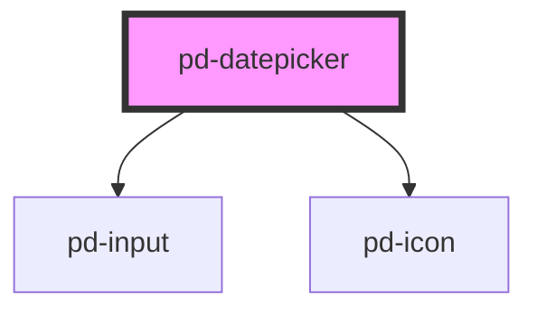

# pd-datepicker

<!-- Auto Generated Below -->

## Properties

| Property         | Attribute         | Description                                                                                                                                                     | Type                                                                                                                                                                                                                                                                                                                                                                                                                                                                                                                                                                                                                                                                                                                                                                                                                                                                                                                                                                                                                                                                                                                                                                                                                                                                                                                                                                                                                                                                                                                                                                                                                                                                                                                                                 | Default     |
| ---------------- | ----------------- | --------------------------------------------------------------------------------------------------------------------------------------------------------------- | ---------------------------------------------------------------------------------------------------------------------------------------------------------------------------------------------------------------------------------------------------------------------------------------------------------------------------------------------------------------------------------------------------------------------------------------------------------------------------------------------------------------------------------------------------------------------------------------------------------------------------------------------------------------------------------------------------------------------------------------------------------------------------------------------------------------------------------------------------------------------------------------------------------------------------------------------------------------------------------------------------------------------------------------------------------------------------------------------------------------------------------------------------------------------------------------------------------------------------------------------------------------------------------------------------------------------------------------------------------------------------------------------------------------------------------------------------------------------------------------------------------------------------------------------------------------------------------------------------------------------------------------------------------------------------------------------------------------------------------------------------- | ----------- |
| `config`         | --                | Set the configuration for the datepicker (only applied at instantiation) Check out https://flatpickr.js.org/options for further documentation about this config | `{ allowInput?: boolean; altFormat?: string; altInput?: boolean; altInputClass?: string; animate?: boolean; appendTo?: HTMLElement; ariaDateFormat?: string; clickOpens?: boolean; closeOnSelect?: boolean; conjunction?: string; dateFormat?: string; defaultDate?: DateOption \| DateOption[]; defaultHour?: number; defaultMinute?: number; defaultSeconds?: number; disable?: DateLimit<DateOption>[]; disableMobile?: boolean; enable?: DateLimit<DateOption>[]; enableSeconds?: boolean; enableTime?: boolean; errorHandler?: (e: Error) => void; formatDate?: (date: Date, format: string, locale: Locale) => string; getWeek?: (date: Date) => string \| number; hourIncrement?: number; ignoredFocusElements?: HTMLElement[]; inline?: boolean; locale?: key \| CustomLocale; maxDate?: DateOption; maxTime?: DateOption; minDate?: DateOption; minTime?: DateOption; minuteIncrement?: number; mode?: "single" \| "multiple" \| "range" \| "time"; monthSelectorType?: "static" \| "dropdown"; nextArrow?: string; noCalendar?: boolean; now?: DateOption; onChange?: Hook \| Hook[]; onClose?: Hook \| Hook[]; onDayCreate?: Hook \| Hook[]; onDestroy?: Hook \| Hook[]; onKeyDown?: Hook \| Hook[]; onMonthChange?: Hook \| Hook[]; onOpen?: Hook \| Hook[]; onParseConfig?: Hook \| Hook[]; onReady?: Hook \| Hook[]; onValueUpdate?: Hook \| Hook[]; onYearChange?: Hook \| Hook[]; onPreCalendarPosition?: Hook \| Hook[]; parseDate?: (date: string, format: string) => Date; plugins?: Plugin<{}>[]; position?: "auto" \| "above" \| "below"; positionElement?: Element; prevArrow?: string; shorthandCurrentMonth?: boolean; static?: boolean; showMonths?: number; time_24hr?: boolean; weekNumbers?: boolean; wrap?: boolean; }` | `undefined` |
| `date`           | `date`            | Sets the current selected date(s), which can be a date string (using current dateFormat), a Date, or anArray of the Dates.                                      | `Date \| DateOption[] \| number \| string`                                                                                                                                                                                                                                                                                                                                                                                                                                                                                                                                                                                                                                                                                                                                                                                                                                                                                                                                                                                                                                                                                                                                                                                                                                                                                                                                                                                                                                                                                                                                                                                                                                                                                                           | `undefined` |
| `disabled`       | `disabled`        | If `true`, the user cannot interact with the input.                                                                                                             | `boolean`                                                                                                                                                                                                                                                                                                                                                                                                                                                                                                                                                                                                                                                                                                                                                                                                                                                                                                                                                                                                                                                                                                                                                                                                                                                                                                                                                                                                                                                                                                                                                                                                                                                                                                                                            | `false`     |
| `error`          | `error`           |                                                                                                                                                                 | `boolean`                                                                                                                                                                                                                                                                                                                                                                                                                                                                                                                                                                                                                                                                                                                                                                                                                                                                                                                                                                                                                                                                                                                                                                                                                                                                                                                                                                                                                                                                                                                                                                                                                                                                                                                                            | `false`     |
| `icon`           | `icon`            | If `true`, a calendar icon is shown at the end of the input.                                                                                                    | `boolean`                                                                                                                                                                                                                                                                                                                                                                                                                                                                                                                                                                                                                                                                                                                                                                                                                                                                                                                                                                                                                                                                                                                                                                                                                                                                                                                                                                                                                                                                                                                                                                                                                                                                                                                                            | `true`      |
| `label`          | `label`           | datepicker box label                                                                                                                                            | `string`                                                                                                                                                                                                                                                                                                                                                                                                                                                                                                                                                                                                                                                                                                                                                                                                                                                                                                                                                                                                                                                                                                                                                                                                                                                                                                                                                                                                                                                                                                                                                                                                                                                                                                                                             | `undefined` |
| `placeholder`    | `placeholder`     | Instructional text that shows before the input has a value.                                                                                                     | `string`                                                                                                                                                                                                                                                                                                                                                                                                                                                                                                                                                                                                                                                                                                                                                                                                                                                                                                                                                                                                                                                                                                                                                                                                                                                                                                                                                                                                                                                                                                                                                                                                                                                                                                                                             | `undefined` |
| `readonly`       | `readonly`        | If `true`, the user cannot modify the value.                                                                                                                    | `boolean`                                                                                                                                                                                                                                                                                                                                                                                                                                                                                                                                                                                                                                                                                                                                                                                                                                                                                                                                                                                                                                                                                                                                                                                                                                                                                                                                                                                                                                                                                                                                                                                                                                                                                                                                            | `false`     |
| `required`       | `required`        | If `true`, the user must fill in a value before submitting a form.                                                                                              | `boolean`                                                                                                                                                                                                                                                                                                                                                                                                                                                                                                                                                                                                                                                                                                                                                                                                                                                                                                                                                                                                                                                                                                                                                                                                                                                                                                                                                                                                                                                                                                                                                                                                                                                                                                                                            | `false`     |
| `verticalAdjust` | `vertical-adjust` | Default vertical adjustment for inline forms                                                                                                                    | `boolean`                                                                                                                                                                                                                                                                                                                                                                                                                                                                                                                                                                                                                                                                                                                                                                                                                                                                                                                                                                                                                                                                                                                                                                                                                                                                                                                                                                                                                                                                                                                                                                                                                                                                                                                                            | `false`     |

## Events

| Event             | Description | Type                                                       |
| ----------------- | ----------- | ---------------------------------------------------------- |
| `pd-change`       |             | `CustomEvent<{ selectedDates: Date[]; dateStr: string; }>` |
| `pd-close`        |             | `CustomEvent<{ selectedDates: Date[]; dateStr: string; }>` |
| `pd-month-change` |             | `CustomEvent<{ selectedDates: Date[]; dateStr: string; }>` |
| `pd-open`         |             | `CustomEvent<{ selectedDates: Date[]; dateStr: string; }>` |
| `pd-ready`        |             | `CustomEvent<{ selectedDates: Date[]; dateStr: string; }>` |
| `pd-value-update` |             | `CustomEvent<{ selectedDates: Date[]; dateStr: string; }>` |
| `pd-year-change`  |             | `CustomEvent<{ selectedDates: Date[]; dateStr: string; }>` |

## Methods

### `clear() => Promise<void>`

Resets the selected dates (if any) and clears the input.

#### Returns

Type: `Promise<void>`

### `close() => Promise<void>`

Closes the calendar.

#### Returns

Type: `Promise<void>`

### `open() => Promise<void>`

Shows/opens the calendar.

#### Returns

Type: `Promise<void>`

### `set(option: any, value?: any) => Promise<void>`

Sets a config option to value, redrawing the calendar and updating the current view, if necessary.
Check out https://flatpickr.js.org/options or https://flatpickr.js.org/instance-methods-properties-elements/#setoption-value for further documentation about this config

#### Returns

Type: `Promise<void>`

### `setDate(date: DateOption | DateOption[], triggerChange?: boolean, format?: string) => Promise<void>`

Sets the current selected date(s) to date, which can be a date string, a Date, or anArray of the Dates.
Optionally, pass true as the second argument to force any onChange events to fire.
And if you’re passing a date string with a format other than your dateFormat, provide a dateStrFormat e.g. "m/d/Y"

#### Returns

Type: `Promise<void>`

### `toggle() => Promise<void>`

Shows/opens the calendar if its closed, hides/closes it otherwise.

#### Returns

Type: `Promise<void>`

## Dependencies

### Depends on

- [pd-input](../pd-input)
- [pd-icon](../pd-icon)

### Graph

----------------------------------------------

*Built with [StencilJS](https://stenciljs.com/)*
