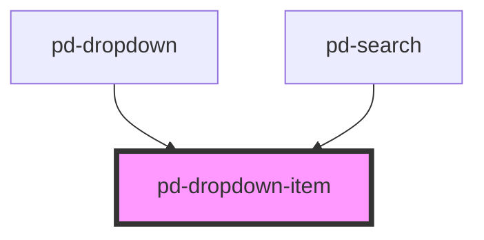

# pd-dropdown-item

<!-- Auto Generated Below -->

## Properties

| Property   | Attribute  | Description | Type               | Default     |
| ---------- | ---------- | ----------- | ------------------ | ----------- |
| `mark`     | `mark`     |             | `number \| string` | `undefined` |
| `selected` | `selected` |             | `boolean`          | `false`     |
| `value`    | `value`    |             | `string`           | `''`        |

## Dependencies

### Used by

 - [pd-dropdown](../pd-dropdown)
 - [pd-search](../pd-search)

### Graph

----------------------------------------------

*Built with [StencilJS](https://stenciljs.com/)*
