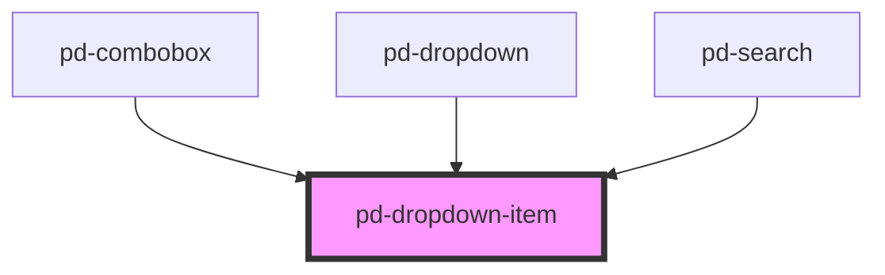

# pd-dropdown-item

<!-- Auto Generated Below -->

## Properties

| Property    | Attribute   | Description                          | Type               | Default     |
| ----------- | ----------- | ------------------------------------ | ------------------ | ----------- |
| `highlight` | `highlight` | Find an highlight this text in value | `number \| string` | `undefined` |
| `selected`  | `selected`  | Sets this item to selected           | `boolean`          | `false`     |
| `value`     | `value`     | Value for this item                  | `string`           | `''`        |

## Dependencies

### Used by

 - [pd-combobox](../pd-combobox)
 - [pd-dropdown](../pd-dropdown)
 - [pd-search](../pd-search)

### Graph

----------------------------------------------

*Built with [StencilJS](https://stenciljs.com/)*
