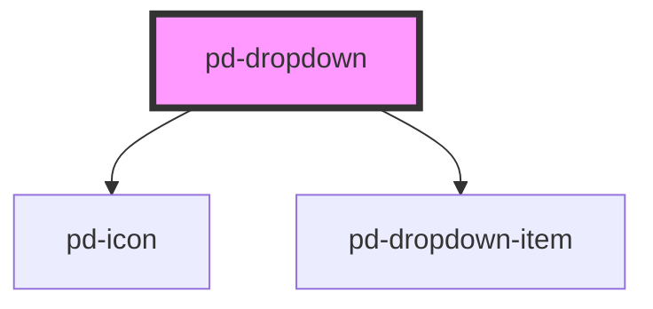

# pd-dropdown

## Usage

```html
<pd-dropdown items="..."></pd-dropdown>
```

Dropdown items are defined using the following data structure. _Be aware that these cannot be defined directly in html._

```javascript
const items = [
  { id: '1', label: 'Mitteilungen und Verschiedenes', value: 'a1' },
  { id: '2', label: 'Pa.Iv. Semadeni. Fakultatives', value: 'a2' },
  { id: '3', label: 'Referendum für die Unterstützung Olympischer Spiele durch den Bund', value: 'a3' },
  ...
];
```

## Interfaces

```javascript
interface DropdownItem {
    id: string;
    label: string;
    value: string;
    selected?: boolean;
}
```

<br><br>

### vuejs Sample

```html
<pd-dropdown class="form-group" :items.prop="stateItems" label="select item" @pd-change="itemChanged"></pd-dropdown>
```

_To pass arrays or objects to webcomponents you need to append the attribute name with the `.prop` modifier._
More info on [prop modifier](https://vuejs.org/v2/api/#v-bind)

<!-- Auto Generated Below -->


## Properties

| Property        | Attribute     | Description                             | Type             | Default                                                             |
| --------------- | ------------- | --------------------------------------- | ---------------- | ------------------------------------------------------------------- |
| `emptyItem`     | `empty-item`  | Enable selection of an empty item       | `boolean`        | `false`                                                             |
| `emptyItemData` | --            | Data used for the empty item            | `DropdownItem`   | `{         id: '0',         label: '-',         value: null,     }` |
| `itemCount`     | `item-count`  | Items visible in dropdown               | `number`         | `5`                                                                 |
| `items`         | --            | Items to display and select in dropdown | `DropdownItem[]` | `[]`                                                                |
| `placeholder`   | `placeholder` | Placeholder when no item is selected    | `string`         | `''`                                                                |


## Events

| Event       | Description | Type                        |
| ----------- | ----------- | --------------------------- |
| `pd-change` |             | `CustomEvent<DropdownItem>` |


## Dependencies

### Depends on

- [pd-icon](../pd-icon)
- [pd-dropdown-item](../pd-dropdown-item)

### Graph


----------------------------------------------

*Built with [StencilJS](https://stenciljs.com/)*
