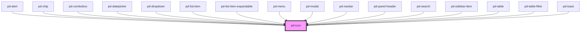

# pd-icon

<!-- Auto Generated Below -->

## Properties

| Property      | Attribute      | Description                               | Type                 | Default     |
| ------------- | -------------- | ----------------------------------------- | -------------------- | ----------- |
| `flip`        | `flip`         | Flip in X/Y direction                     | `"x" \| "xy" \| "y"` | `undefined` |
| `name`        | `name`         | Name of an icon from the provided gallery | `string`             | `undefined` |
| `rotate`      | `rotate`       | Rotation in 'deg'                         | `number`             | `undefined` |
| `size`        | `size`         | Size of the icon in 'rem'                 | `number`             | `2.375`     |
| `spin`        | `spin`         | Spin animation in ms per rotation         | `number`             | `undefined` |
| `spinReverse` | `spin-reverse` | change animation direction                | `boolean`            | `false`     |

## Dependencies

### Used by

 - [pd-alert](../pd-alert)
 - [pd-chip](../pd-chip)
 - [pd-combobox](../pd-combobox)
 - [pd-datepicker](../pd-datepicker)
 - [pd-dropdown](../pd-dropdown)
 - [pd-list-item](../pd-list-item)
 - [pd-list-item-expandable](../pd-list-item-expandable)
 - [pd-menu](../pd-menu)
 - [pd-modal](../pd-modal)
 - [pd-navbar](../pd-navbar)
 - [pd-panel-header](../pd-panel-header)
 - [pd-search](../pd-search)
 - [pd-sidebar-item](../pd-sidebar-item)
 - [pd-table](../pd-table)
 - [pd-table-filter](../pd-table-filter)
 - [pd-toast](../pd-toast)

### Graph

----------------------------------------------

*Built with [StencilJS](https://stenciljs.com/)*
