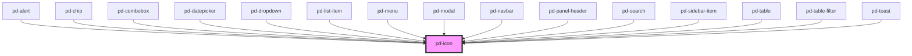

# pd-icon

## Usage

#### With Source File

```html
<pd-icon src="/assets/icons/cancel.svg"></pd-icon>
```

#### With Name

```html
<pd-icon name="cancel"></pd-icon>
```

## Available Icon Names

| []()          |                  |              |               |              |                  |                  |               |
| ------------- | ---------------- | ------------ | ------------- | ------------ | ---------------- | ---------------- | ------------- |
| add           | appview          | audio        | breadcrumb    | cancel       | checkbox_checked | checkbox_default | clipboard     |
| close_small   | close            | compensation | configuration | confirm      | contact          | dictionary       | documents     |
| dropdown      | expand           | filter       | folder_closed | folder_open  | gallery          | link             | list          |
| menu          | message          | microphone   | parlament     | play         | press            | print            | profile       |
| radio_checked | radio_default    | research     | reservation   | search       | sort             | status_green     | status_orange |
| status_red    | status_undefined | support      | alert_danger  | alert_info   | alert_success    | alert_warning    | calendar      |
| delete        | drag_drop        | edit         | menu_actions  | confirm_bold | close_bold       |                  |               |

<!-- Auto Generated Below -->


## Properties

| Property      | Attribute      | Description                                    | Type                 | Default     |
| ------------- | -------------- | ---------------------------------------------- | -------------------- | ----------- |
| `flip`        | `flip`         | Flip in X/Y direction                          | `"x" \| "xy" \| "y"` | `undefined` |
| `name`        | `name`         | Name of an icon from the provided gallery      | `string`             | `undefined` |
| `rotate`      | `rotate`       | Rotation in 'deg'                              | `number`             | `0`         |
| `size`        | `size`         | Size of the icon in 'rem'                      | `number`             | `undefined` |
| `spin`        | `spin`         | Spin animation in ms per rotation              | `number`             | `undefined` |
| `spinReverse` | `spin-reverse` | change animation direction                     | `boolean`            | `false`     |
| `src`         | `src`          | Specifies the `src` url of an SVG file to use. | `string`             | `undefined` |


## Dependencies

### Used by

 - [pd-alert](../pd-alert)
 - [pd-chip](../pd-chip)
 - [pd-combobox](../pd-combobox)
 - [pd-datepicker](../pd-datepicker)
 - [pd-dropdown](../pd-dropdown)
 - [pd-list-item](../pd-list-item)
 - [pd-menu](../pd-menu)
 - [pd-modal](../pd-modal)
 - [pd-navbar](../pd-navbar)
 - [pd-panel-header](../pd-panel-header)
 - [pd-search](../pd-search)
 - [pd-sidebar-item](../pd-sidebar-item)
 - [pd-table](../pd-table)
 - [pd-table-filter](../pd-table-filter)
 - [pd-toast](../pd-toast)

### Graph


----------------------------------------------

*Built with [StencilJS](https://stenciljs.com/)*
