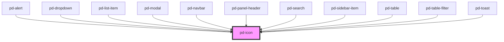

# pd-icon

## Usage

#### With Source File

```html
<pd-icon src="/assets/icons/cancel.svg"></pd-icon>
```

#### With Name

```html
<pd-icon name="cancel"></pd-icon>
```

## Available Icon Names

| []()           |                   |              |                |              |                   |                   |                |
| -------------- | ----------------- | ------------ | -------------- | ------------ | ----------------- | ----------------- | -------------- |
| add            | appview           | audio        | breadcrumb     | cancel       | checkbox\_checked | checkbox\_default | clipboard      |
| close\_small   | close             | compensation | configuration  | confirm      | contact           | dictionary        | documents      |
| dropdown       | expand            | filter       | folder\_closed | folder\_open | gallery           | link              | list           |
| menu           | message           | microphone   | parlament      | play         | press             | print             | profile        |
| radio\_checked | radio\_default    | research     | reservation    | search       | sort              | status\_green     | status\_orange |
| status\_red    | status\_undefined | support      |                |              |                   |                   |                |

<!-- Auto Generated Below -->

## Properties

| Property      | Attribute      | Description                                    | Type                 | Default     |
| ------------- | -------------- | ---------------------------------------------- | -------------------- | ----------- |
| `flip`        | `flip`         | Flip in X/Y direction                          | `"x" \| "xy" \| "y"` | `undefined` |
| `name`        | `name`         | Name of an icon from the provided gallery      | `string`             | `undefined` |
| `rotate`      | `rotate`       | Rotation in 'deg'                              | `number`             | `0`         |
| `size`        | `size`         | Size of the icon in 'em'                       | `number`             | `undefined` |
| `spin`        | `spin`         | Spin animation in ms per rotation              | `number`             | `undefined` |
| `spinReverse` | `spin-reverse` | change animation direction                     | `boolean`            | `false`     |
| `src`         | `src`          | Specifies the `src` url of an SVG file to use. | `string`             | `undefined` |

## Dependencies

### Used by

-   [pd-alert](../pd-alert)
-   [pd-dropdown](../pd-dropdown)
-   [pd-list-item](../pd-list-item)
-   [pd-modal](../pd-modal)
-   [pd-navbar](../pd-navbar)
-   [pd-panel-header](../pd-panel-header)
-   [pd-search](../pd-search)
-   [pd-sidebar-item](../pd-sidebar-item)
-   [pd-table](../pd-table)
-   [pd-table-filter](../pd-table-filter)
-   [pd-toast](../pd-toast)

### Graph



---

_Built with [StencilJS](https://stenciljs.com/)_
