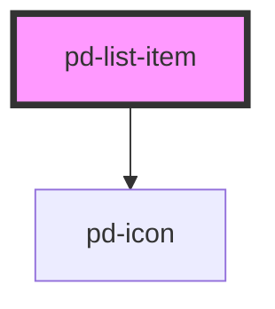

# pd-list-item-expandable

<!-- Auto Generated Below -->

## Properties

| Property | Attribute | Description               | Type                                            | Default     |
| -------- | --------- | ------------------------- | ----------------------------------------------- | ----------- |
| `status` | `status`  | Status icon for list item | `"danger" \| "success" \| "unset" \| "warning"` | `undefined` |

## Dependencies

### Depends on

-   [pd-icon](../pd-icon)

### Graph

---

_Built with [StencilJS](https://stenciljs.com/)_
