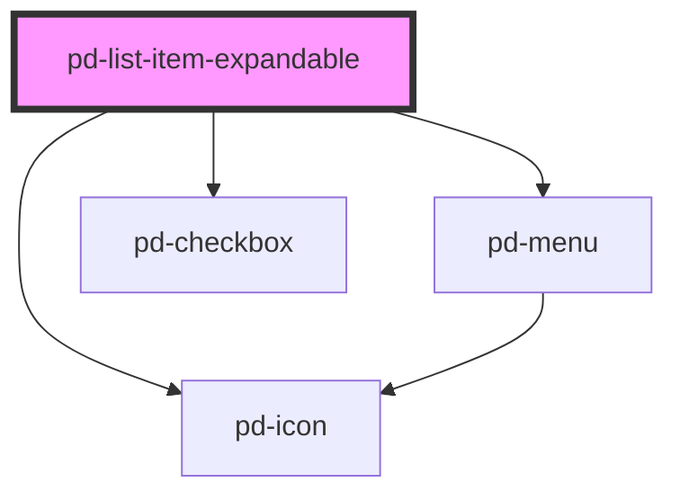

# pd-list-item-expandable

## Usage

#### Expandable List

```html
<pd-list class="m-3">
    <pd-list-item-expandable checkbox edit expandable expand menu status="success" style="--pd-list-background: #fff">
        <div>16.3112</div>
        <a>WBK-NR: Antrag auf Ablehnung </a>
        <div slot="expandable">Expandable Content</div>
        <pd-menu-item text="Drucken" slot="menu">
            <pd-icon size="2" name="print"></pd-icon>
        </pd-menu-item>
        <pd-menu-item text="Support" slot="menu">
            <pd-icon size="2" name="support"></pd-icon>
        </pd-menu-item>
    </pd-list-item-expandable>
</pd-list>
```

## Styles

| Style                          | Default       | Description                               |
| ------------------------------ | ------------- | ----------------------------------------- |
| `--pd-list-item-background`    | `transparent` | background color of list item             |
| `--pd-list-item-content-hover` | `bon-jour`    | background color for content hover effect |

## Slots

| Name         | Description                                    |
| ------------ | ---------------------------------------------- |
|              | default slot for list content                  |
| action-left  | left of actions for additional action buttons  |
| action-right | right of actions for additional action buttons |
| expandable   | for additional, expandable content             |

<!-- Auto Generated Below -->

## Properties

| Property       | Attribute       | Description                                                         | Type                                                      | Default     |
| -------------- | --------------- | ------------------------------------------------------------------- | --------------------------------------------------------- | ----------- |
| `checkbox`     | `checkbox`      | Shows edit button                                                   | `boolean`                                                 | `false`     |
| `checked`      | `checked`       | Sets check state of the checkbox true/false                         | `boolean`                                                 | `false`     |
| `collapsed`    | `collapsed`     | Expands / collapses the inner content of the list item              | `boolean`                                                 | `true`      |
| `contentClick` | `content-click` | Adds content click event and style to item                          | `boolean`                                                 | `false`     |
| `edit`         | `edit`          | Shows edit button                                                   | `boolean`                                                 | `false`     |
| `expand`       | `expand`        | Shows expand button with simple event (no expandable inner content) | `boolean`                                                 | `false`     |
| `expandable`   | `expandable`    | Shows expand (toggle) button for expandable inner content           | `boolean`                                                 | `false`     |
| `menu`         | `menu`          | Shows menu button                                                   | `boolean`                                                 | `false`     |
| `status`       | `status`        | Status icon for list item                                           | `"danger" \| "info" \| "success" \| "unset" \| "warning"` | `undefined` |

## Events

| Event              | Description                                          | Type                   |
| ------------------ | ---------------------------------------------------- | ---------------------- |
| `pd-collapsed`     | Inner content collapsed/expanded                     | `CustomEvent<boolean>` |
| `pd-content-click` | Event on content click (content-click has to be set) | `CustomEvent<void>`    |
| `pd-edit`          | Edit button click event                              | `CustomEvent<void>`    |
| `pd-expand`        | Expand button click event                            | `CustomEvent<void>`    |
| `pd-selected`      | Checkbox selected event                              | `CustomEvent<boolean>` |

## Dependencies

### Depends on

-   [pd-icon](../pd-icon)
-   [pd-menu](../pd-menu)
-   [pd-checkbox](../pd-checkbox)

### Graph



---

_Built with [StencilJS](https://stenciljs.com/)_
