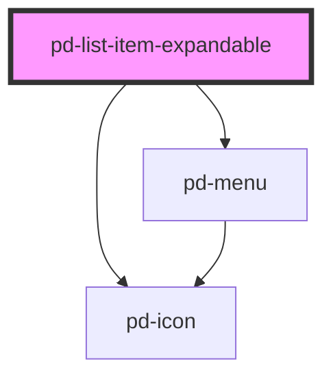

# pd-list-item-expandable

## Usage

#### Expandable List

```html
<pd-list class="m-3">
    <pd-list-item-expandable edit expandable expand menu status="success" style="--pd-list-background: #fff">
        <div>16.3112</div>
        <a>WBK-NR: Antrag auf Ablehnung </a>
        <div slot="expandable">Expandable Content</div>
        <pd-menu-item text="Drucken" slot="menu">
            <pd-icon size="2" name="print"></pd-icon>
        </pd-menu-item>
        <pd-menu-item text="Support" slot="menu">
            <pd-icon size="2" name="support"></pd-icon>
        </pd-menu-item>
    </pd-list-item-expandable>
</pd-list>
```

<!-- Auto Generated Below -->

## Properties

| Property     | Attribute    | Description                           | Type                                                      | Default     |
| ------------ | ------------ | ------------------------------------- | --------------------------------------------------------- | ----------- |
| `collapsed`  | `collapsed`  | Expands / collapses the panel content | `boolean`                                                 | `true`      |
| `edit`       | `edit`       |                                       | `boolean`                                                 | `false`     |
| `expand`     | `expand`     |                                       | `boolean`                                                 | `false`     |
| `expandable` | `expandable` |                                       | `boolean`                                                 | `false`     |
| `menu`       | `menu`       |                                       | `boolean`                                                 | `false`     |
| `status`     | `status`     | Status icon for list item             | `"danger" \| "info" \| "success" \| "unset" \| "warning"` | `undefined` |

## Events

| Event       | Description | Type                |
| ----------- | ----------- | ------------------- |
| `pd-edit`   |             | `CustomEvent<void>` |
| `pd-expand` |             | `CustomEvent<void>` |

## Dependencies

### Depends on

-   [pd-icon](../pd-icon)
-   [pd-menu](../pd-menu)

### Graph



---

_Built with [StencilJS](https://stenciljs.com/)_
