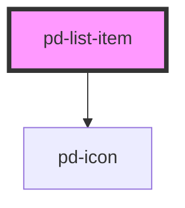

# pd-list-item

<!-- Auto Generated Below -->

## Properties

| Property | Attribute | Description               | Type                                                      | Default     |
| -------- | --------- | ------------------------- | --------------------------------------------------------- | ----------- |
| `status` | `status`  | Status icon for list item | `"danger" \| "info" \| "success" \| "unset" \| "warning"` | `undefined` |

## Slots

| Slot | Description      |
| ---- | ---------------- |
|      | ListItem content |

## CSS Custom Properties

| Name                        | Description                   |
| --------------------------- | ----------------------------- |
| `--pd-list-item-background` | Background color of list item |

## Dependencies

### Depends on

- [pd-icon](../pd-inline-icon)

### Graph

----------------------------------------------

*Built with [StencilJS](https://stenciljs.com/)*
