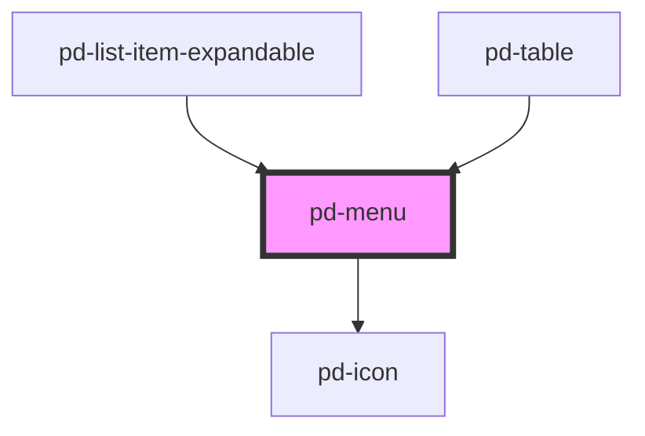

# pd-menu

## Usage

```html
<pd-menu>
    <pd-menu-item></pd-menu-item>
</pd-menu>
```

<br><br>

### vuejs Sample

```html
<pd-menu>
    <pd-menu-item text="Print" @click="printIt()">
        <pd-icon size="2" name="print"></pd-icon>
    </pd-menu-item>
</pd-menu>
```

_To pass arrays or objects to webcomponents you need to append the attribute name with the `.prop` modifier._
More info on [prop modifier](https://vuejs.org/v2/api/#v-bind)

<!-- Auto Generated Below -->


## Properties

| Property      | Attribute      | Description                             | Type                                                                                                                                                                                                         | Default          |
| ------------- | -------------- | --------------------------------------- | ------------------------------------------------------------------------------------------------------------------------------------------------------------------------------------------------------------ | ---------------- |
| `invertColor` | `invert-color` | Switch dark colors to bright font color | `boolean`                                                                                                                                                                                                    | `false`          |
| `items`       | --             | Items to display and select in dropdown | `any[]`                                                                                                                                                                                                      | `[]`             |
| `label`       | `label`        | Label nearby to the dot menu icon       | `string`                                                                                                                                                                                                     | `''`             |
| `placement`   | `placement`    | Prefered placement of menu dropdown     | `"auto" \| "auto-end" \| "auto-start" \| "bottom" \| "bottom-end" \| "bottom-start" \| "left" \| "left-end" \| "left-start" \| "right" \| "right-end" \| "right-start" \| "top" \| "top-end" \| "top-start"` | `'bottom-start'` |


## Methods

### `close() => Promise<void>`

Close menu

#### Returns

Type: `Promise<void>`


### `open() => Promise<void>`

Open menu

#### Returns

Type: `Promise<void>`


## Slots

| Slot | Description |
| ---- | ----------- |
|      | Menu items  |


## CSS Custom Properties

| Name                           | Description                                        |
| ------------------------------ | -------------------------------------------------- |
| `--pd-menu-horizontal-padding` | Possibility to change inner width of the dropdown  |
| `--pd-menu-label-color`        | Possibility to change color of label and icon      |
| `--pd-menu-label-weight`       | Possibility to change the label font-weight        |
| `--pd-menu-max-width`          | Max width for                                      |
| `--pd-menu-vertical-padding`   | Possibility to change inner height of the dropdown |


## Dependencies

### Used by

 - [pd-list-item-expandable](../pd-list-item-expandable)
 - [pd-table](../pd-table)

### Depends on

- [pd-icon](../pd-icon)

### Graph


----------------------------------------------

*Built with [StencilJS](https://stenciljs.com/)*
