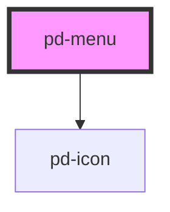

# pd-menu

## Usage

```html
<pd-menu>
    <pd-menu-item></pd-menu-item>
</pd-menu>
```

<br><br>

### vuejs Sample

```html
<pd-menu>
    <pd-menu-item text="Print" @click="printIt()">
        <pd-icon size="2" name="print"></pd-icon>
    </pd-menu-item>
</pd-menu>
```

_To pass arrays or objects to webcomponents you need to append the attribute name with the `.prop` modifier._
More info on [prop modifier](https://vuejs.org/v2/api/#v-bind)

## Styles

| Style                              | Default     | Description                                        |
| ---------------------------------- | ----------- | -------------------------------------------------- |
| `--pd-menu-max-width`              | `undefined` | Max width for                                      |
| `--pd-dropdown-vertical-padding`   | `0.625em`   | Possibility to change inner height of the dropdown |
| `--pd-dropdown-horizontal-padding` | `0.75em`    | Possibility to change inner width of the dropdown  |

<!-- Auto Generated Below -->


## Properties

| Property        | Attribute         | Description                             | Type      | Default                                                             |
| --------------- | ----------------- | --------------------------------------- | --------- | ------------------------------------------------------------------- |
| `emptyItem`     | `empty-item`      | Enable selection of an empty item       | `boolean` | `false`                                                             |
| `emptyItemData` | `empty-item-data` | Data used for the empty item            | `any`     | `{         id: '0',         label: '-',         value: null,     }` |
| `items`         | --                | Items to display and select in dropdown | `any[]`   | `[]`                                                                |
| `placeholder`   | `placeholder`     | Placeholder when no item is selected    | `string`  | `''`                                                                |


## Events

| Event       | Description | Type               |
| ----------- | ----------- | ------------------ |
| `pd-change` |             | `CustomEvent<any>` |


## Methods

### `close() => Promise<void>`

Close menu

#### Returns

Type: `Promise<void>`


### `open() => Promise<void>`

Open menu

#### Returns

Type: `Promise<void>`


## Dependencies

### Depends on

- [pd-icon](../pd-icon)

### Graph


----------------------------------------------

*Built with [StencilJS](https://stenciljs.com/)*
