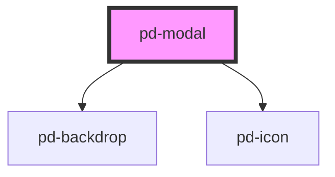

# pd-modal

<!-- Auto Generated Below -->

## Properties

| Property | Attribute | Description                                                                                                         | Type            | Default     |
| -------- | --------- | ------------------------------------------------------------------------------------------------------------------- | --------------- | ----------- |
| `config` | --        | Configuration properties                                                                                            | `PdModalConfig` | `undefined` |
| `data`   | `data`    |                                                                                                                     | `any`           | `undefined` |
| `open`   | `open`    | This triggers the modal to visually open / close Alternatively the openModal() method can be called to trigger this | `boolean`       | `false`     |

## Events

| Event          | Description                                                          | Type               |
| -------------- | -------------------------------------------------------------------- | ------------------ |
| `pd-on-closed` | Event with returnData that will be executed when the modal is closed | `CustomEvent<any>` |

## Methods

### `closeModal(returnData?: any) => Promise<void>`

This triggers the modal to visually close
Alternatively the open property can be set to 'false' to trigger this
returnData: will be added to 'pdModalWhenClosed' Event or 'whenClosed' method

#### Returns

Type: `Promise<void>`

### `openModal() => Promise<void>`

This triggers the modal to visually open
Alternatively the open property can be set to 'true' to trigger this

#### Returns

Type: `Promise<void>`

### `whenClosed() => Promise<any>`

Returns a promise that will be resolved with modal 'returnData' when the modal is closed

#### Returns

Type: `Promise<any>`

## Dependencies

### Depends on

- [pd-backdrop](../pd-backdrop)
- [pd-icon](../pd-icon)

### Graph

----------------------------------------------

*Built with [StencilJS](https://stenciljs.com/)*
