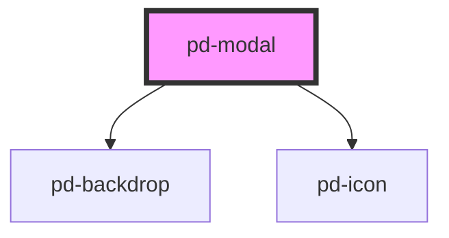

# pd-modal

<!-- Auto Generated Below -->

## Properties

| Property | Attribute | Description | Type                                                                                                                                                        | Default     |
| -------- | --------- | ----------- | ----------------------------------------------------------------------------------------------------------------------------------------------------------- | ----------- |
| `config` | --        |             | `{ component: string; title: string; minWidth: string; maxWidth: string; minHeight: string; maxHeight: string; backdropVisible: boolean; zIndex: string; }` | `undefined` |
| `data`   | `data`    |             | `any`                                                                                                                                                       | `undefined` |
| `open`   | `open`    |             | `boolean`                                                                                                                                                   | `false`     |

## Events

| Event                  | Description | Type               |
| ---------------------- | ----------- | ------------------ |
| `pd-modal-when-closed` |             | `CustomEvent<any>` |

## Methods

### `closeModal(returnData?: any) => Promise<void>`

#### Returns

Type: `Promise<void>`

### `openModal() => Promise<void>`

#### Returns

Type: `Promise<void>`

### `whenClosed() => Promise<any>`

#### Returns

Type: `Promise<any>`

## Dependencies

### Depends on

- [pd-backdrop](../pd-backdrop)
- [pd-icon](../pd-icon)

### Graph

----------------------------------------------

*Built with [StencilJS](https://stenciljs.com/)*
