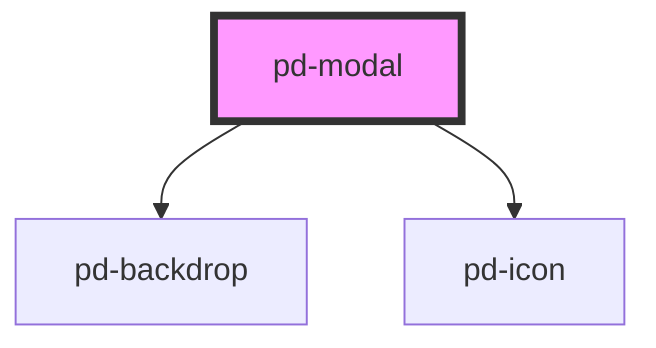

# pd-modal

## Usage

```html
<pd-modal>
    <p>Modal Content</p>
    <div slot="footer">
        <pd-button outline>Cancel</pd-button>
        <pd-button>Save</pd-button>
    </div>
</pd-modal>
```

> The `pd-modal` should be created dynamically and appended to the `<body>`

## Interfaces

```javascript
interface PdModalConfig {
    title: string;
    minWidth?: string;
    maxWidth?: string;
    minHeight?: string;
    maxHeight?: string;
    backdropVisible?: boolean;
    zIndex?: string;
    close?: () => void;
}
```

<!-- Auto Generated Below -->


## Properties

| Property | Attribute | Description              | Type            | Default     |
| -------- | --------- | ------------------------ | --------------- | ----------- |
| `config` | --        | Configuration properties | `PdModalConfig` | `undefined` |


## Events

| Event         | Description                                                    | Type                |
| ------------- | -------------------------------------------------------------- | ------------------- |
| `pd-backdrop` | Event that will be executed when the modal backdrop is clicked | `CustomEvent<void>` |
| `pd-closed`   | Event that will be executed when the is closed                 | `CustomEvent<void>` |
| `pd-escape`   | Event that will be executed when the escape button was clicked | `CustomEvent<void>` |


## Dependencies

### Depends on

- [pd-backdrop](../pd-backdrop)
- [pd-icon](../pd-icon)

### Graph


----------------------------------------------

*Built with [StencilJS](https://stenciljs.com/)*
