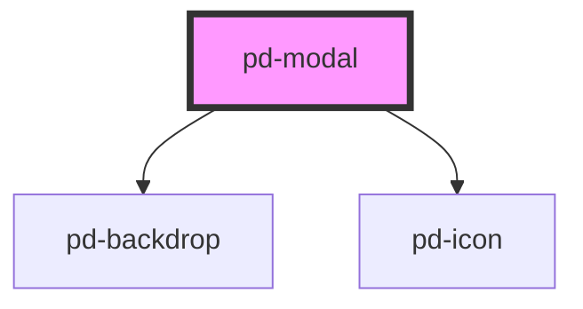

# pd-modal

## Usage

```html
<pd-modal open="true"></pd-modal>
```

The modal should be created dynamically in code and appended to the `<body>`. Provided methods can be used to open/close and return data from the modal. The implementation can vary depending on the framework used.

### Javascript example

Content template

```html
<template id="pd-modal-template">
    <span class="content-text">Currently open modals:</span>
    <span class="content-modal-count"></span>
    <div slot="footer">
        <pd-button class="close-button" outline>close</pd-button>
        <pd-button class="save-button">save</pd-button>
    </div>
</template>
```

Dynamically create the modal and append to body

```javascript
function presentModal() {
    // dynamically create the modal
    const modal = document.createElement('pd-modal');

    modal.config = {
        title: 'Modal Title',
        minWidth: '500px',
        minHeight: '250px',
        maxWidth: '80%',
        backdropVisible: false,
        zIndex: 10000,
    };

    // pass data to the modal
    modal.data = {
        first: 10,
        second: 20,
    };

    // create the template and add functionality
    const contentTemplate = document.querySelector('#pd-modal-template').content.cloneNode(true);

    // on close button
    const closeButton = contentTemplate.querySelector('.close-button');
    closeButton.addEventListener('click', () => modal.closeModal());

    // on save button
    const saveButton = contentTemplate.querySelector('.save-button');
    saveButton.addEventListener('click', () =>
        modal.closeModal({
            sum: modal.data.first + modal.data.second,
        }),
    );

    // append the content template
    modal.append(contentTemplate);

    // one way to get returned data is to use the whenClosed promise
    modal.whenClosed().then(returnData => {
        console.log('whenClosed method', returnData);
    });

    // another way is to listen on the pd-on-closed event
    modal.addEventListener('pd-on-closed', event => console.log('pd-on-closed event', event.detail));

    // present the modal
    document.body.appendChild(modal);

    modal.open = true;
}
```

<br><br>
### vuejs Sample

```html
<script type="text/x-template" id="survey-template">
    <pd-modal ref="modal" open="true" :config.prop="config" @pd-on-closed ="closed()">
        <div  @keyup.enter="ok()" >
            <p>Sind Sie</p><pd-radio name="happy" value="true" v-model-pd="happy" label="Zufrieden"></pd-radio>
            <pd-radio name="happy" value="false" v-model-pd="happy" label="Unzufrieden"></pd-radio>
            <pd-input class="form-group" v-model-pd="firstname" inputmode="text" label="Vorname" ></pd-input>
            <pd-input class="form-group" v-model-pd="lastname" inputmode="text" label="Name" ></pd-input>
        </div>
        <div slot="footer">
            <pd-button @click="cancel()" type="button" outline color="primary" >Cancel</pd-button>
            <pd-button @click="ok()" type="submit" @keyup.enter="ok()"  color="primary" >Übernehmen</pd-button>
        </div>
    </pd-modal>
</script>
```

```javascript
var SurveyModal = {
    name: 'SurveyModal',
    props: ['title', 'lastname'],
    data: function() {
        return {
            firstname: '',
            lastname: '',
            state: '',
            happy: false,
            config: {
                title: this.$props.title,
                backdropVisible: true,
            },
        };
    },
    methods: {
        ok: function() {
            this.state = 'ok';
            this.$refs.modal.closeModal();
        },
        cancel: function() {
            this.state = 'cancelled';
            this.$refs.modal.closeModal();
        },
        closed: function() {
            this.$emit('modal-close', {
                firstname: this.firstname,
                lastname: this.lastname,
                state: this.state,
                happy: this.happy,
            });
        },
    },
    template: '#survey-template',
};

var app = new Vue({
    el: '#app',
    data: { }
    methods: {
        modalClosed: function(params) {
            // modal has removed itself from DOM
            // console.log("modalClosed params", params)
        },
        openModal: function(title) {
            // dynamic instancing of componentents, for modaldialogs
            var SurveyModalClass = Vue.extend(SurveyModal);
            var instance = new SurveyModalClass({
                propsData: { title },
            });
            // register close handler for data
            instance.$once('modal-close', this.modalClosed);
            // mount
            instance.$mount(); // pass nothing
            // insert into DOM
            this.$el.appendChild(instance.$el);
        }
    }
});

```
<br><br>
## Interfaces

```javascript
interface PdModalConfig {
    title: string;
    minWidth?: string;
    maxWidth?: string;
    minHeight?: string;
    maxHeight?: string;
    backdropVisible?: boolean;
    zIndex?: string;
    close?: () => void;
}
```

<!-- Auto Generated Below -->


## Properties

| Property | Attribute | Description                                                                                                         | Type            | Default     |
| -------- | --------- | ------------------------------------------------------------------------------------------------------------------- | --------------- | ----------- |
| `config` | --        | Configuration properties                                                                                            | `PdModalConfig` | `undefined` |
| `data`   | `data`    |                                                                                                                     | `any`           | `undefined` |
| `open`   | `open`    | This triggers the modal to visually open / close Alternatively the openModal() method can be called to trigger this | `boolean`       | `false`     |


## Events

| Event          | Description                                                          | Type               |
| -------------- | -------------------------------------------------------------------- | ------------------ |
| `pd-on-closed` | Event with returnData that will be executed when the modal is closed | `CustomEvent<any>` |


## Methods

### `closeModal(returnData?: any) => Promise<void>`

This triggers the modal to visually close
Alternatively the open property can be set to 'false' to trigger this
returnData: will be added to 'pdModalWhenClosed' Event or 'whenClosed' method

#### Returns

Type: `Promise<void>`


### `openModal() => Promise<void>`

This triggers the modal to visually open
Alternatively the open property can be set to 'true' to trigger this

#### Returns

Type: `Promise<void>`


### `whenClosed() => Promise<any>`

Returns a promise that will be resolved with modal 'returnData' when the modal is closed

#### Returns

Type: `Promise<any>`


## Dependencies

### Depends on

- [pd-backdrop](../pd-backdrop)
- [pd-icon](../pd-icon)

### Graph


----------------------------------------------

*Built with [StencilJS](https://stenciljs.com/)*
