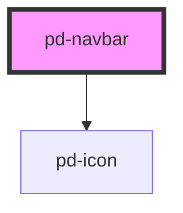

# pd-navbar

## Usage

```html
<pd-navbar>
    <pd-navbar-item text="Item 1"></pd-navbar-item>
    <pd-navbar-item text="Item 2"></pd-navbar-item>
    <pd-navbar-item text="Item 3" href="http://www.google.ch"></pd-navbar-item>
</pd-navbar>
```

<!-- Auto Generated Below -->


## Dependencies

### Depends on

- [pd-icon](../pd-icon)

### Graph


----------------------------------------------

*Built with [StencilJS](https://stenciljs.com/)*
