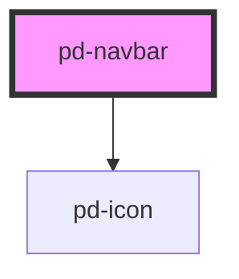

# pd-navbar

## Usage

#### Navbar

```html
<pd-navbar>
    <pd-navbar-item text="Item 1"></pd-navbar-item>
    <pd-navbar-item text="Item 2"></pd-navbar-item>
    <pd-navbar-item text="Item 3" href="http://www.google.ch"></pd-navbar-item>
</pd-navbar>
```

#### Define Mobile breakpoint

```html
<pd-navbar mobile-breakpoint="600">
    ...
</pd-navbar>
```

<!-- Auto Generated Below -->


## Properties

| Property           | Attribute           | Description | Type     | Default |
| ------------------ | ------------------- | ----------- | -------- | ------- |
| `mobileBreakpoint` | `mobile-breakpoint` |             | `number` | `800`   |


## Events

| Event     | Description | Type                |
| --------- | ----------- | ------------------- |
| `pd-menu` |             | `CustomEvent<void>` |


## Slots

| Slot       | Description         |
| ---------- | ------------------- |
|            | Navbar items        |
| `"mobile"` | Mobile navbar items |


## Dependencies

### Depends on

- [pd-icon](../pd-inline-icon)

### Graph


----------------------------------------------

*Built with [StencilJS](https://stenciljs.com/)*
