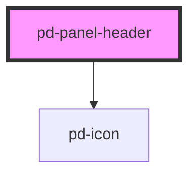

# pd-panel-header

<!-- Auto Generated Below -->

## Events

| Event             | Description | Type                   |
| ----------------- | ----------- | ---------------------- |
| `pd-on-collapsed` |             | `CustomEvent<boolean>` |

## Dependencies

### Depends on

- [pd-icon](../pd-icon)

### Graph

----------------------------------------------

*Built with [StencilJS](https://stenciljs.com/)*
