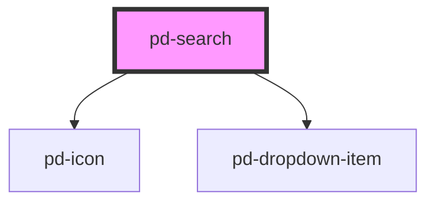

# pd-search

## Usage

```html
<pd-search label="label" results="..."></pd-search>
```

Search results must be provided dynamically depending on the current input. `pd-on-input` can be used to detect when a new search result should be provided.

```javascript
const results = [
    `Some random result 1`,
    `Some random result 2`,
    `Some random result 3`,
    ...
];
```

## Interfaces

```javascript
interface DropdownItem {
    id: string;
    label: string;
    value: string;
    selected?: boolean;
}
```

<!-- Auto Generated Below -->

## Properties

| Property      | Attribute     | Description                                                 | Type               | Default     |
| ------------- | ------------- | ----------------------------------------------------------- | ------------------ | ----------- |
| `disabled`    | `disabled`    | If `true`, the user cannot interact with the input.         | `boolean`          | `false`     |
| `highlight`   | `highlight`   | Show matching parts in resuls as highlighted                | `boolean`          | `true`      |
| `label`       | `label`       |                                                             | `string`           | `undefined` |
| `placeholder` | `placeholder` | Instructional text that shows before the input has a value. | `string`           | `undefined` |
| `results`     | --            |                                                             | `string[]`         | `[]`        |
| `value`       | `value`       | The value of the input.                                     | `number \| string` | `''`        |

## Events

| Event          | Description                             | Type                                  |
| -------------- | --------------------------------------- | ------------------------------------- |
| `pd-on-blur`   | Emitted when the input loses focus.     | `CustomEvent<void>`                   |
| `pd-on-change` | Emitted when the value has changed.     | `CustomEvent<InputChangeEventDetail>` |
| `pd-on-focus`  | Emitted when the input has focus.       | `CustomEvent<void>`                   |
| `pd-on-input`  | Emitted when a keyboard input occurred. | `CustomEvent<InputChangeEventDetail>` |
| `pd-on-search` | Emitted when a search request occurred. | `CustomEvent<InputChangeEventDetail>` |

## Methods

### `setFocus() => Promise<void>`

Sets focus on the specified `pd-input`. Use this method instead of the global
`input.focus()`.

#### Returns

Type: `Promise<void>`

## Dependencies

### Depends on

-   [pd-icon](../pd-icon)
-   [pd-dropdown-item](../pd-dropdown-item)

### Graph



---

_Built with [StencilJS](https://stenciljs.com/)_
