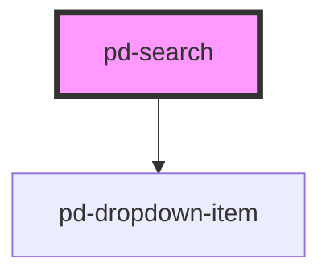

# pd-search

<!-- Auto Generated Below -->

## Properties

| Property        | Attribute     | Description                                                     | Type               | Default        |
| --------------- | ------------- | --------------------------------------------------------------- | ------------------ | -------------- |
| `disabled`      | `disabled`    | If `true`, the user cannot interact with the input.             | `boolean`          | `false`        |
| `error`         | `error`       |                                                                 | `boolean`          | `false`        |
| `helperText`    | `helper-text` |                                                                 | `string`           | `undefined`    |
| `label`         | `label`       |                                                                 | `string`           | `undefined`    |
| `name`          | `name`        | The name of the control, which is submitted with the form data. | `string`           | `this.inputId` |
| `open`          | `open`        |                                                                 | `boolean`          | `false`        |
| `placeholder`   | `placeholder` | Instructional text that shows before the input has a value.     | `string`           | `undefined`    |
| `readonly`      | `readonly`    | If `true`, the user cannot modify the value.                    | `boolean`          | `false`        |
| `searchStrings` | --            |                                                                 | `string[]`         | `[]`           |
| `value`         | `value`       | The value of the input.                                         | `number \| string` | `''`           |

## Events

| Event          | Description                             | Type                                  |
| -------------- | --------------------------------------- | ------------------------------------- |
| `pd-on-blur`   | Emitted when the input loses focus.     | `CustomEvent<void>`                   |
| `pd-on-change` | Emitted when the value has changed.     | `CustomEvent<InputChangeEventDetail>` |
| `pd-on-focus`  | Emitted when the input has focus.       | `CustomEvent<void>`                   |
| `pd-on-input`  | Emitted when a keyboard input occurred. | `CustomEvent<KeyboardEvent>`          |

## Methods

### `setFocus() => Promise<void>`

Sets focus on the specified `pd-input`. Use this method instead of the global
`input.focus()`.

#### Returns

Type: `Promise<void>`

## Dependencies

### Depends on

- [pd-dropdown-item](../pd-dropdown-item)

### Graph

----------------------------------------------

*Built with [StencilJS](https://stenciljs.com/)*
