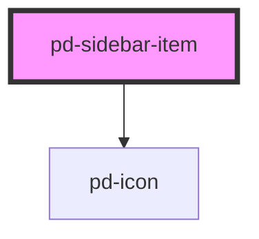

# pd-sidebar-item

## Usage

```html
<pd-sidebar-item icon="..." text="Item 1"></pd-sidebar-item>
```

<!-- Auto Generated Below -->


## Properties

| Property   | Attribute   | Description                               | Type      | Default     |
| ---------- | ----------- | ----------------------------------------- | --------- | ----------- |
| `active`   | `active`    | show an item as active                    | `boolean` | `false`     |
| `href`     | `href`      | Set href to create a link button          | `string`  | `undefined` |
| `icon`     | `icon`      | Path to an svg asset                      | `string`  | `undefined` |
| `iconName` | `icon-name` | Name of an icon from the library          | `string`  | `undefined` |
| `size`     | `size`      | Icon size                                 | `number`  | `2`         |
| `target`   | `target`    | Sets target for link button e.g. '_blank' | `string`  | `'_blank'`  |
| `text`     | `text`      | Item text                                 | `string`  | `''`        |


## Dependencies

### Depends on

- [pd-icon](../pd-icon)

### Graph


----------------------------------------------

*Built with [StencilJS](https://stenciljs.com/)*
