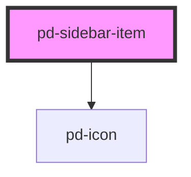

# pd-sidebar-item

## Usage

```html
<pd-sidebar-item icon="..." text="Item 1"></pd-sidebar-item>
```

<!-- Auto Generated Below -->

## Properties

| Property  | Attribute | Description                                | Type      | Default     |
| --------- | --------- | ------------------------------------------ | --------- | ----------- |
| `enabled` | `enabled` |                                            | `boolean` | `false`     |
| `href`    | `href`    | Set href to create a link button           | `string`  | `undefined` |
| `icon`    | `icon`    |                                            | `string`  | `undefined` |
| `size`    | `size`    |                                            | `string`  | `'2'`       |
| `target`  | `target`  | Sets target for link button e.g. '\_blank' | `string`  | `'_blank'`  |
| `text`    | `text`    |                                            | `string`  | `''`        |

## Dependencies

### Depends on

-   [pd-icon](../pd-icon)

### Graph



---

_Built with [StencilJS](https://stenciljs.com/)_
