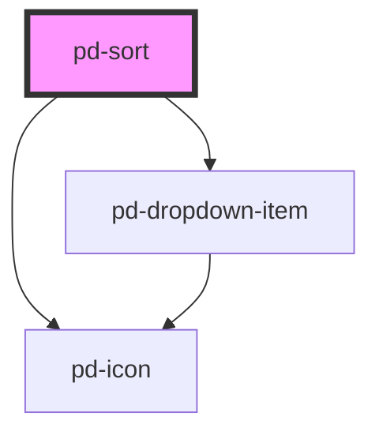

# pd-sort

## Usage

```html
<pd-sort items="..." reverse-item></pd-sort>
```

-   the pd-change event emits the selected item (which has a sort property (asc | desc) --> sort the list that way )
-   the pd-reverse event emits the selected item too (which has a sort property (asc | desc) --> sort the list THE OTHER WAY way than its saved in the sort property ❗)

Dropdown items are defined using the following data structure. _Be aware that these cannot be defined directly in html._

```javascript
const items = [
      { id: '1', label: 'Name', value: 'name', sort: 'asc', selected: 'true' },
      { id: '2', label: 'Dokumententitel', value: 'documentTitle', sort: 'desc' },
      { id: '3', label: 'Änderungsdatum', value: 'changedAt', sort: 'asc' },
      { id: '4', label: 'Erstellungsdatum', value: 'createdAt', sort: 'asc' },
      { id: '6', label: 'Author/in', value: 'author', sort: 'asc' },
      { id: '7', label: 'Umkehren', value: 'reverse', bottomSection: 'true' },  ...
];
```

the sort property can either be 'asc', 'desc' or null (for the emptyitem)<br>

## Reverse Item

If there is a reverseItem = true property passed to the component, the dropdown will show a reverse item at the bottom of the dropdown.
The reverse item is defined by a default or can be overwritten using the following data structure. _Be aware that these cannot be defined directly in html._

```javascript
const reverseItem = {
    label: 'Sort. umkehren',
    selected: false,
};
```

## Interfaces

```javascript
interface SortDropdownItem {
    id: string;
    label: string;
    value?: string | number;
    selected?: boolean;
    sort?: 'desc' | 'asc' | null;
}
```

<!-- Auto Generated Below -->


## Properties

| Property          | Attribute      | Description                                                  | Type                 | Default                                                                                 |
| ----------------- | -------------- | ------------------------------------------------------------ | -------------------- | --------------------------------------------------------------------------------------- |
| `disabled`        | `disabled`     | If `true`, the user cannot interact with the input.          | `boolean`            | `false`                                                                                 |
| `emptyItem`       | `empty-item`   | Enable selection of an empty item                            | `boolean`            | `false`                                                                                 |
| `emptyItemData`   | --             | Data used for the empty item                                 | `SortDropdownItem`   | `{         id: '0',         label: '-',         value: null,         sort: null,     }` |
| `itemCount`       | `item-count`   | Items visible in dropdown                                    | `number`             | `7`                                                                                     |
| `items`           | --             | Items to display and select in dropdown                      | `SortDropdownItem[]` | `[]`                                                                                    |
| `label`           | `label`        | Label                                                        | `string`             | `'Sortieren nach:'`                                                                     |
| `placeholder`     | `placeholder`  | Placeholder when no item is selected                         | `string`             | `''`                                                                                    |
| `reverseItem`     | `reverse-item` | Enables the revert item at the bottom of the dropdown        | `boolean`            | `false`                                                                                 |
| `reverseItemData` | --             | Data used for the reverse item at the bottom of the dropdown | `SortRevertItem`     | `{         label: 'Sort. Umkehren',         selected: false,     }`                     |


## Events

| Event        | Description | Type                            |
| ------------ | ----------- | ------------------------------- |
| `pd-change`  |             | `CustomEvent<SortDropdownItem>` |
| `pd-reverse` |             | `CustomEvent<SortDropdownItem>` |


## Methods

### `reset() => Promise<void>`

Reset the selection of the dropdown

#### Returns

Type: `Promise<void>`


### `setSelectedIndex(index: number) => Promise<void>`

Set a preselected entry by index

#### Returns

Type: `Promise<void>`


## Dependencies

### Depends on

- [pd-icon](../pd-icon)
- [pd-dropdown-item](../pd-dropdown-item)

### Graph


----------------------------------------------

*Built with [StencilJS](https://stenciljs.com/)*
