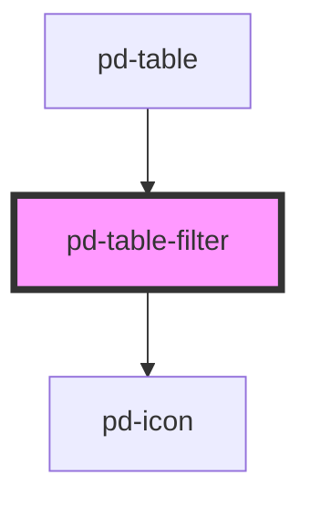

# pd-table-filter

<!-- Auto Generated Below -->

## Events

| Event         | Description                         | Type                  |
| ------------- | ----------------------------------- | --------------------- |
| `pdOnClear`   | Emitted when the input was cleared. | `CustomEvent<void>`   |
| `pdOnClose`   | Emitted when filter is confirmed.   | `CustomEvent<void>`   |
| `pdOnConfirm` | Emitted when filter is confirmed.   | `CustomEvent<string>` |
| `pdOnSearch`  | Emitted when filter changes.        | `CustomEvent<void>`   |

## Methods

### `reset() => Promise<void>`

#### Returns

Type: `Promise<void>`

## Dependencies

### Used by

 - [pd-table](../pd-table)

### Depends on

- [pd-icon](../pd-icon)

### Graph

----------------------------------------------

*Built with [StencilJS](https://stenciljs.com/)*
