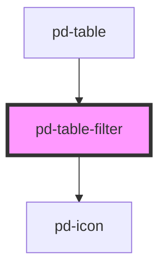

# pd-table-filter

<!-- Auto Generated Below -->

## Properties

| Property | Attribute | Description  | Type     | Default |
| -------- | --------- | ------------ | -------- | ------- |
| `value`  | `value`   | filter value | `string` | `''`    |

## Events

| Event       | Description                       | Type                  |
| ----------- | --------------------------------- | --------------------- |
| `pdClose`   | Emitted when filter is confirmed. | `CustomEvent<void>`   |
| `pdConfirm` | Emitted when filter is confirmed. | `CustomEvent<string>` |
| `pdSearch`  | Emitted when filter changes.      | `CustomEvent<void>`   |

## Methods

### `focusInput() => Promise<void>`

#### Returns

Type: `Promise<void>`

### `reset() => Promise<void>`

#### Returns

Type: `Promise<void>`

### `setValue(value: string) => Promise<void>`

#### Returns

Type: `Promise<void>`

## Dependencies

### Used by

 - [pd-table](../pd-table)

### Depends on

- [pd-icon](../pd-icon)

### Graph

----------------------------------------------

*Built with [StencilJS](https://stenciljs.com/)*
