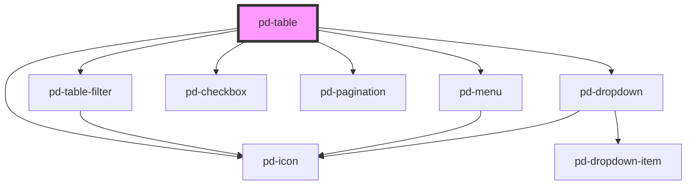

# pd-table

## Usage

#### Table

```html
<pd-table columns="..." rows="..." header-style="dark" selectable show-status> </pd-table>
```

Columns and Rows are defined using the following data structure. _Be aware that these cannot be defined directly in html._

```javascript
const columns = [
    {
        columnName: 'no',
        label: '#',
        width: 50,
        bold: true,
        fixed: true,
        sortable: true,
    },
    {
        columnName: 'column1',
        label: 'Referenz',
        width: 150,
        textAlign: 'right',
    },
    {
        columnName: 'column2',
        label: 'Thema',
        width: 0,
        minWidth: 500,
        sortable: true,
        sortDir: 'asc',
        textAlign: 'left',
    },
];

const rowsData = [
        { no: 1, column1: 'SiK/CPS-19-01', column2: 'Mitteilungen' },
        { no: 2, column1: 'SiK/CPS-19-34', column2: 'Aktuelles as dem VBS, Information und Diskussion' },
        { no: 3, column1: 'SiK/CPS-19-12', column2: 'NKF, Evaluationsverfahren, Information und Diskussion' },
        ...
];
```

**Optional Fields for each row**

```javascript
{
    ...,
    pdIconConfig: { view: true, delete: true };
    pdStatus: 'success';
    pdSelected: true;
}
```

-   The `pdIconConfig` will overwrite the current global configuration.
-   The `pdStatus` add an icon in the front of the row, if globally `show-status` is enabled
    Rows without any status, will get a grey `unset` status.
-   With `pdSelected` you can configure the selected configuration for each row. To enable the checkboxes you have to set the `selectable` configuration globally.

###Selectable

Make rows selectable by setting the `selectable` property to true. Selecting a row triggers the `pd-selected` Event that contains the selected row/rows.  
A Row can be preselected by adding the internal property `pdSelected: true` to any row.

### vuejs Sample

```javascript
var app = new Vue({
    el: '#app',
    data: {
        table: {
            rows: [
                {
                    id: 1,
                    colName: 'test',
                    colText: 's sd saldjsladklsadk öaskdsöaldksaö dsakdöas',
                    colDate: new Date(),
                    colNumber: 1,
                },
                {
                    id: 2,
                    colName: 'test 1',
                    colText: 's sd saldjsladklsadk öaskdsöaldksaö dsakdöas',
                    colDate: new Date('2001-01-02'),
                    colNumber: 3,
                },
                {
                    id: 3,
                    colName: 'test 2',
                    colText: 's sd saldjsladklsadk öaskdsöaldksaö dsakdöas',
                    colDate: new Date('2021-02-02'),
                    colNumber: 21,
                },
                {
                    id: 4,
                    colName: 'test 3',
                    colText: 's sd saldjsladklsadk öaskdsöaldksaö dsakdöas',
                    colDate: new Date('2001-02-02'),
                    colNumber: 31,
                },
            ],
            columns: [
                {
                    columnName: 'id',
                    label: '#',
                    width: 50,
                    bold: true,
                    sortable: true,
                    sortDir: 'desc',
                    fixed: true,
                },
                {
                    columnName: 'colName',
                    label: 'Name',
                    width: 100,
                    bold: true,
                    textAlign: 'right',
                    fixed: true,
                    filter: false,
                },
                {
                    columnName: 'colText',
                    label: 'Text',
                    width: 0,
                    minWidth: 300,
                    filter: true,
                    bold: false,
                    textAlign: 'right',
                },
                {
                    columnName: 'colDate',
                    label: 'Created',
                    width: 120,
                    sortable: true,
                    filter: false,
                    bold: false,
                    textAlign: 'right',
                },
                {
                    columnName: 'colNumber',
                    label: 'Count',
                    width: 100,
                    filter: false,
                    bold: false,
                    sortable: true,
                },
            ],
        },
    },
});
```

```html
<pd-table header-style="light" :rows.prop="table.rows" :columns.prop="table.columns"></pd-table>
```

_To pass arrays or objects to webcomponents you need to append the attribute name with the `.prop` modifier._
More info on [prop modifier](https://vuejs.org/v2/api/#v-bind)

## Interfaces

```javascript
interface PdColumn {
    columnName: string;
    label: string;
    width: number;
    minWidth: number;
    bold?: boolean;
    sortDir?: 'desc' | 'asc';
    sortable?: boolean;
    fixed?: boolean;
    textAlign?: 'left' | 'right' | 'center';
    sortFunc?: (a: any, b: any, dir: string) => number;
    displayFunc?: (value: any) => any;
    filterFunc?: (value: any, filter: string) => boolean;
}
```

<!-- Auto Generated Below -->


## Properties

| Property           | Attribute            | Description                                            | Type                          | Default                                                                                                                                                            |
| ------------------ | -------------------- | ------------------------------------------------------ | ----------------------------- | ------------------------------------------------------------------------------------------------------------------------------------------------------------------ |
| `columns`          | --                   | A definition for each column of the table              | `PdColumn[]`                  | `[]`                                                                                                                                                               |
| `headerHeight`     | `header-height`      | Height of header cells                                 | `string`                      | `'48'`                                                                                                                                                             |
| `headerStyle`      | `header-style`       | The table style                                        | `"dark" \| "gray" \| "light"` | `'dark'`                                                                                                                                                           |
| `iconConfig`       | --                   | The configuration for the last column, the icon column | `PdTableIconConfiguration`    | `undefined`                                                                                                                                                        |
| `menuLabel`        | `menu-label`         |                                                        | `string`                      | `undefined`                                                                                                                                                        |
| `minWidth`         | `min-width`          | The minimum width the table should take                | `string`                      | `'300'`                                                                                                                                                            |
| `pageSizes`        | --                   | Available Page sizes for paging                        | `DropdownItem[]`              | `[         { id: '1', label: '10', value: 10, selected: true },         { id: '2', label: '25', value: 25 },         { id: '3', label: '100', value: 100 },     ]` |
| `paging`           | `paging`             | Enables paging                                         | `boolean`                     | `false`                                                                                                                                                            |
| `pagingLocation`   | `paging-location`    | Location of paging element                             | `"left" \| "right"`           | `'right'`                                                                                                                                                          |
| `rowHeight`        | `row-height`         | Height of rows                                         | `string`                      | `'48'`                                                                                                                                                             |
| `rows`             | --                   | The data definition for each row to display            | `PdTableRow[]`                | `[]`                                                                                                                                                               |
| `selectable`       | `selectable`         | Make rows selectable with a checkbox                   | `boolean`                     | `false`                                                                                                                                                            |
| `showActionColumn` | `show-action-column` | Show button column and context menu                    | `boolean`                     | `false`                                                                                                                                                            |
| `showStatus`       | `show-status`        | Allow to render a status icon per row                  | `boolean`                     | `false`                                                                                                                                                            |


## Events

| Event            | Description                                        | Type                         |
| ---------------- | -------------------------------------------------- | ---------------------------- |
| `pd-clicked-row` | Triggers an event when row was clicked             | `CustomEvent<any>`           |
| `pd-delete`      | Triggers an event when the delete icon was clicked | `CustomEvent<any>`           |
| `pd-edit`        | Triggers an event when the edit icon was clicked   | `CustomEvent<any>`           |
| `pd-selected`    | Triggers when one or all rows get selected         | `CustomEvent<SelectedEvent>` |
| `pd-view`        | Triggers an event when the view icon was clicked   | `CustomEvent<any>`           |


## Methods

### `refresh() => Promise<void>`


#### Returns

Type: `Promise<void>`


### `unselectAll() => Promise<void>`


#### Returns

Type: `Promise<void>`


## Slots

| Slot | Description       |
| ---- | ----------------- |
|      | Action menu items |


## Dependencies

### Depends on

- [pd-table-filter](../pd-table-filter)
- [pd-menu](../pd-menu)
- [pd-checkbox](../pd-checkbox)
- [pd-icon](../pd-icon)
- [pd-pagination](../pd-pagination)
- [pd-dropdown](../pd-dropdown)

### Graph


----------------------------------------------

*Built with [StencilJS](https://stenciljs.com/)*
